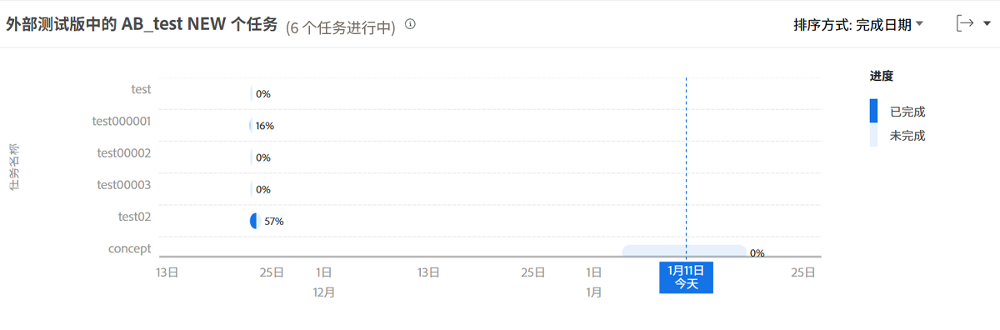

# 查看正在执行的任务

在本视频中，您将了解到：

* 如何访问“正在执行的任务”图表
* 如何快速查看项目中哪些任务尚未完成

>[!VIDEO](https://video.tv.adobe.com/v/335052/?quality=12&learn=on&enablevpops)

## 任务级数据

使用“正在执行的任务”图表，您可以深入了解特定项目的任务，以查看每项活动任务完成的工作量以及这些任务的进度。通过该图表，您可以了解项目中需要完成哪些任务，以及这些任务的完成百分比是多少。

此信息可以帮助您确定：

* 人们正在开展哪些工作。
* 哪些任务可能会使项目面临风险。
* 任务距离完成有多远。
* 您需要与谁讨论特定任务。

在图表上，您可以看到：

1. 任务名称在左侧。
1. 日期位于底部。
1. 任务栏中的深蓝色表示某项任务已完成的工作量。
1. 任务栏中的浅蓝色表示某项任务需要完成的工作量。
1. 任务栏右侧的数字显示任务完成的百分比。
