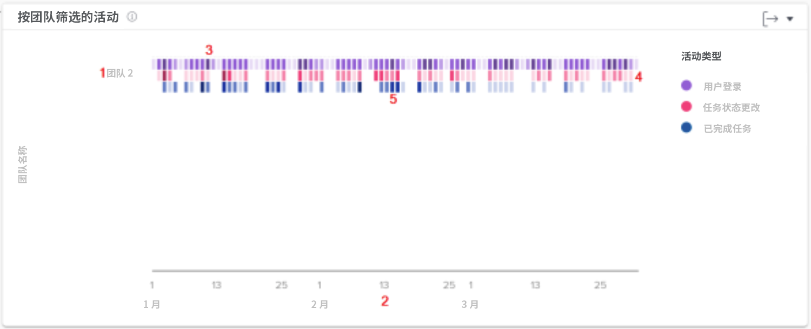

# 通过团队图表了解活动

通过“按团队划分的活动”图表，您可以了解到组织中的主团队在 Workfront 中是如何分配其时间的。Workfront 用户可以属于多个团队，但只能属于一个主团队。人员图表中使用的团队仅由指定该团队为其主团队的用户组成。

各类活动（登录的用户、任务状态更改和已完成的任务）会以不同颜色显示，以对所过滤的时段内的这些事件进行总结。

查看此信息可以帮助您确定：

* 主团队内正在进行哪些活动，以及以何种速度进行。
* 哪些主队工作量过大，或对该系统的利用率更高。
* 工作分配是否适合主团队。

在图表上，您可以看到：

1. 主团队名称位于左侧。
1. 底部的日期来自选定的日期范围。
1. 紫色框显示分配给该项目的用户当天登录了系统，深色阴影表示登录的用户数量较多。
1. 粉色框显示用户在当天更改了项目任务的状态，其中较深的阴影表示更改的任务状态数量较多。
1. 蓝色框表示用户完成了项目中的一个任务，其中深色框表示完成的任务数量较多。

## 如何浏览到图表

1. 单击左侧面板中的 [!UICONTROL People] 选项卡。
1. 使用 [!UICONTROL Filter] 来选择一支或多支主团队来进行检查。
1. 您会看到“按团队划分的活动”图表会显示在人员图表的顶部。
