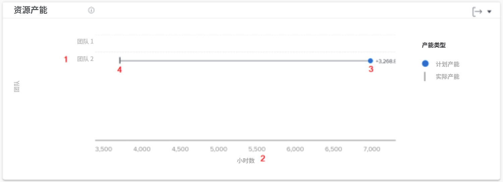
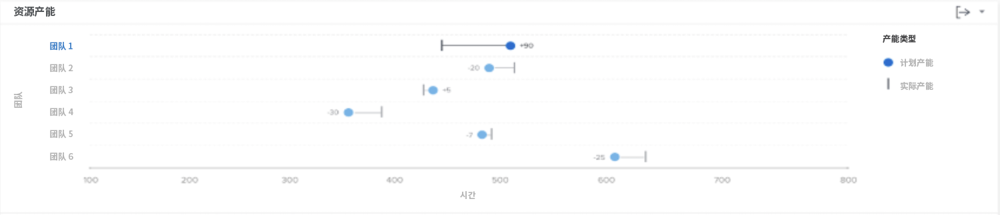

# 了解资源产能图表

资源能力图表显示在过滤时间期内与小组的总可用小时数相比分配给主小组的计划小时数。

此比较可帮助您确定您是否没有向团队分配足够的工作，或者他们是否可能因工作负荷过大而感到倦怠。 单击团队名称，此时将显示团队产能图表，其中显示有关已过滤时间段的团队产能的更多详细信息。

查看此信息可帮助您确定：

* 主团队是否分配过多或分配不足。
* 哪些主团队可以工作。

在图表上，您可以看到以下关键详细信息：

1. 主队名称在左边。
1. 小时数横跨底部。 这是图表的x轴，用于计算上述团队中显示的小时范围。
1. 圆圈显示分配给主团队的已计划小时数。
1. 垂直线显示主团队可用的总小时数。

## 如何导航到图表

1. 单击 [!UICONTROL People] 选项卡。
1. 使用 [!UICONTROL Filter] 选择要检查的一个或多个Home团队。
1. 您将看到 [!UICONTROL Resource capacity] 图表显示在团队活动图表下方。

## 如何使用图表

您必须添加筛选器并选择日期范围，以在 [!UICONTROL Enhanced analytics] Workfront的区域。 如果您以前添加过过滤器，则这些过滤器在删除之前处于活动状态。

在“资源能力”图表上，您可以：

* 将鼠标悬停在主团队线路上，查看还有多少小时可供安排、主团队计划要完成的小时数以及工作总小时数（标记为超过、不足或满负荷）。
* 使用图表右上角的导出按钮导出图表数据。
* 单击主团队名称以打开团队容量图表。 在“团队产能”图表中放大到较小的时间范围可更新显示在“资源产能”图表上的数据。
