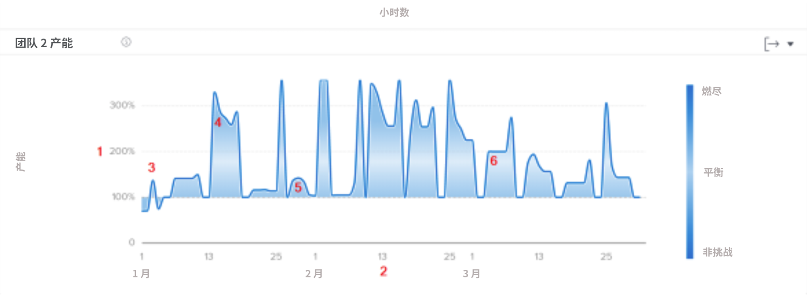
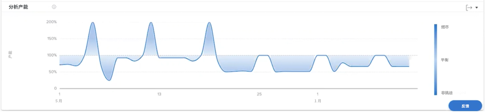

# 了解团队产能

团队产能图表可显示主团队超额分配或分配不足的情况。该图表显示的是在某一天分配给主团队的工作量，并在主团队接近疲倦或工作量不具挑战性时指定一个较深的蓝色。颜色越浅、越透明，表示工作量越均衡。

查看此信息可以帮助您确定：

* 主团队在何时分配获得的工作过多或过少。
* 主团队是否每天都面临着超额分配或分配不足的情况。
* 主团队每天的工作量有多稳定。
* 如果布置新工作，是否会遇到产能问题。

在图表上，您可以看到：

1. 主团队产能的百分比在左侧。
1. 底部的日期来自选定的日期范围。
1. 深蓝色的填充颜色表示主团队的工作量要么让人感到疲倦 (4)，要么不具挑战性。
1. 较浅或较透明的蓝色表示主团队的工作量是平衡的

## 如何浏览到图表

1. 单击左侧面板中的 [!UICONTROL People] 选项卡。
1. 使用 [!UICONTROL Filter] 来选择一支或多支主团队来进行检查。
1. 您将看到团队产能图表出现。

## 如何使用该图表

要在“分析”区域的“人员”部分的图表上显示数据，您必须要添加过滤器并选择日期范围。如果您之前已经添加了过滤器，则在移除它们之前，这些过滤器会一直处于活动状态。

在团队产能图表上，您可以：

* 将鼠标悬停在图表上的某个点上可查看日期线。
* 将鼠标悬停在图表线上的某个点上，可以查看给定日期的既定小时数和规划小时数，以及产能百分比和主团队此时是超过、低于还是达到负荷。
* 通过在项目的某个点上单击并拖动鼠标来放大日期。（此操作会更新所有其他图表以放大同一日期范围。）
* 使用图表右上角的导出按钮导出图表数据。
