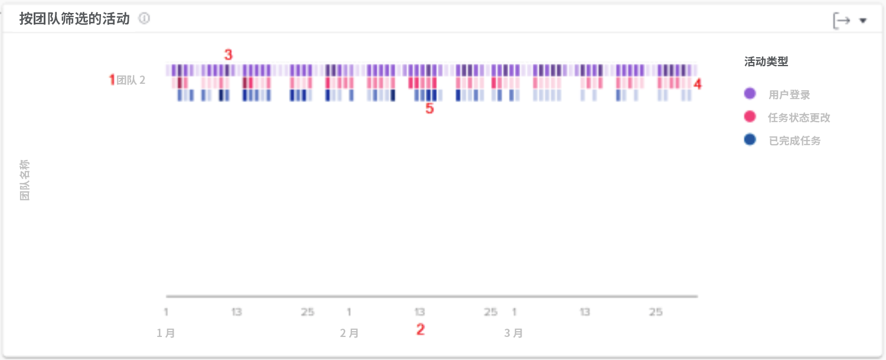

# 了解工作和人员图表

工作图表会从项目和任务的角度显示活动，而人员图表则会从主团队的角度显示活动。

从左侧面板菜单中选择您要查看的分析图表类型——工作或人员。

## 工作图表

![图像：查找 [!UICONTROL Analytics] 功能，位于 [!DNL Workfront Classic]](assets/section-1-1.png)

当您转到工作图表时，默认情况下您会看到：

1. KPI 统计数据
1. 任务执行计划
1. 项目活动
1. 项目树形图（上面未显示）

当您深入研究数据时，燃尽图和正在执行的任务图表会出现。

* 单击“任务执行计划”视图中的一个项目，该项目的“燃尽图”视图将会出现在其下方。
* 单击“树形图”视图中的项目，“燃尽图”和“正在执行的任务”视图将会出现在其下方。

## 人员图表 - 团队活动

在图表上，您可以看到：

1. 主团队名称位于左侧。
1. 底部的日期来自选定的日期范围。
1. 紫色框显示分配给该项目的用户当天登录了系统，深色阴影表示登录的用户数量较多。
1. 粉色框显示用户在当天更改了项目任务的状态，其中较深的阴影表示更改的任务状态数量较多。
1. 蓝色框表示用户完成了项目中的一个任务，其中深色框表示完成的任务数量较多。

