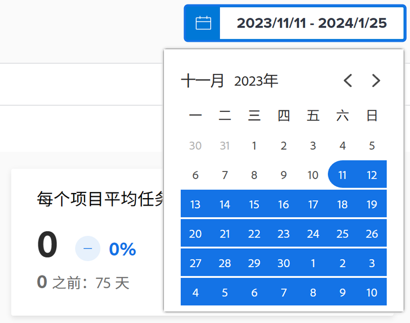
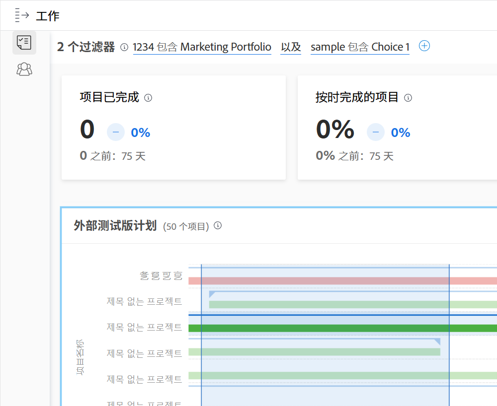

# 了解日期范围和时间范围

当查看 [!DNL Enhanced analytics] 图表时，日期范围是使用日程表构件指定的。当您通过单击并拖动来定义特定区域时，会在图表中创建时间范围，因此您可以放大并更详细地查看该时间范围内的信息。

## 日期范围

只需单击日程表中的任意日期来指示范围内的一个日期，然后单击任意日期来指示范围另一端的日期。如果您的开始日期和结束日期不在同一个月，请使用日程表顶部的箭头导航到不同的月份。

默认情况下，[!DNL Analytics] 中的图表显示过去 60 天和未来 15 天的数据。使用 [!DNL Analytics] 时，您可以选择一个新的日期范围并将其应用于所有图表。

当您刷新页面、离开或注销/登录 Workfront 时，日期范围将会重置为默认值。

## 时间范围

单击并拖动时间线的相应部分来创建时间范围过滤器。此时间范围现在适用于“工作”区域中的所有图表，并且它会显示在过滤器栏中任何其他过滤器的旁边。通过单击并拖动相关区域来更新时间范围，以深入挖掘图表。要删除时间范围过滤器，只需将鼠标悬停在过滤器栏中的该时间范围过滤器上，然后单击出现的 X。

当您刷新页面、离开或注销 Workfront 时，时间范围将会被删除，并且会重置日期范围。

>[!NOTE]
>
>您不能将此时间范围选项与 Project 树形图一起使用。
