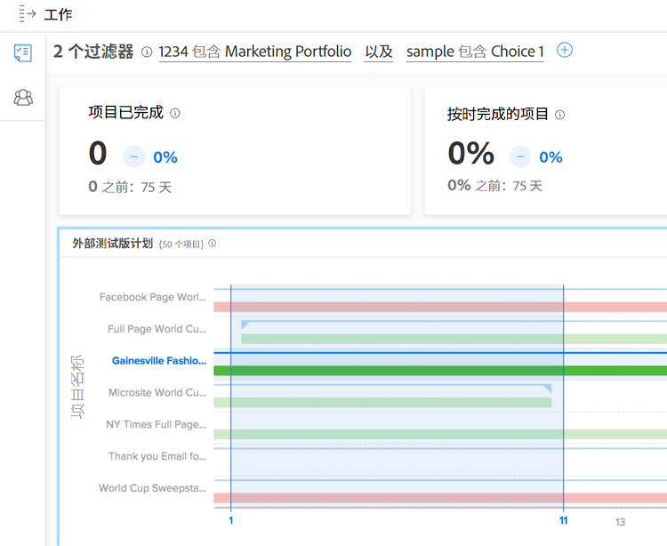

# 了解日期范围和时间范围

查看 [!DNL Enhanced analytics] 使用日历小组件指定图表、日期范围。 时间范围是在单击并拖动以定义特定区域时在图表中创建的，因此您可以放大并获得该时间范围内信息的更详细视图。

## 日期范围

只需单击日历中的任意日期以指示范围中的某个日期，然后单击任意日期以指示范围的另一个结束日期。 如果您的开始日期和结束日期不在同一月份，请使用日历顶部的箭头导航到不同的月份。

中的图表 [!DNL Analytics] 默认显示过去60天和未来15天的数据。 您可以在使用时选择新的日期范围并将其应用于所有图表 [!DNL Analytics].

在刷新页面、离开页面或注销/登录Workfront时，日期范围将重置为默认值。

## 时间范围

在时间轴的所需部分周围单击并拖动以创建时间范围过滤器。 此时间范围现在适用于工作区中的所有图表，并且显示在过滤器栏中的任何其他过滤器旁边。 通过单击并拖动各个区域以更新时间范围，从而深入了解图表。 要删除时间范围过滤器，只需将鼠标悬停在过滤器栏中的时间范围上，然后单击显示的X即可。

在刷新页面、导航离开或注销Workfront时，时间范围将被删除并且日期范围将被重置。

>[!NOTE]
>
>您不能将此时间范围选项与项目树状图和资源产能图表一起使用。
