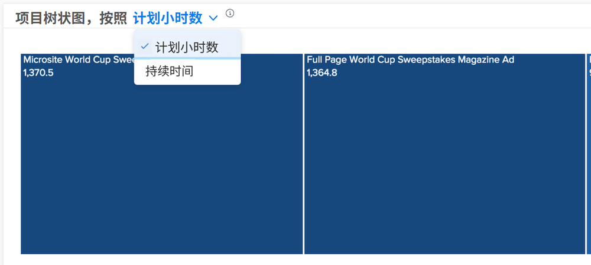

# 了解 [!UICONTROL Enhanced Analytics]

在Burndown和Project树状图中，您可以按计划小时数或持续时间查看信息，具体取决于您认为Workfront环境更准确的内容。

计划小时数是默认值。 如果切换到持续时间，则当您从 [!DNL Analytics] 然后重新登录Workfront。

## 盒子大小和颜色阴影是什么意思？

较小、较浅的蓝色框表示小时数，而较大的框和较深的蓝色阴影表示比较的小时数更多。 有关详细信息，请参阅 [了解项目树状图可视化图表](https://experienceleague.adobe.com/docs/workfront/using/reporting/enhanced-analytics/project-treemap-overview.html?lang=en).
