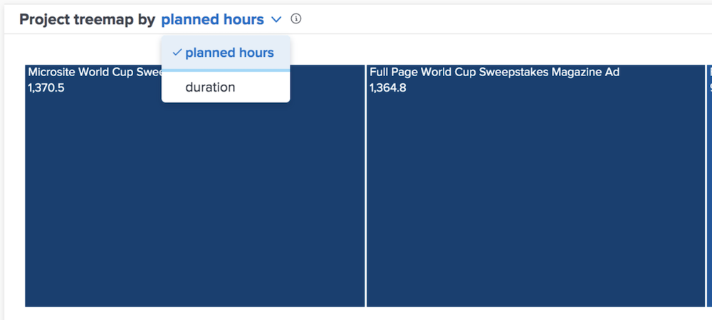

# 了解规划小时数和持续时间视图

在燃尽图和项目树形图中，您可以按规划小时数或持续时间查看信息，具体取决于您认为对 Workfront 环境更为准确的内容。

规划小时数是默认值。 如果您切换到持续时间，那么在您离开 [!DNL Analytics] 然后返回，以及在 Workfront 登录之间切换时，这仍然有效。

## 盒子尺寸和颜色深浅是什么意思？

相比之下，较小、较浅的蓝色框表示较少的时间，而较大的框和较深的蓝色则表示较多的时间。 若要了解更多信息，请参阅[了解项目树形图可视化。](https://experienceleague.adobe.com/docs/workfront/using/reporting/enhanced-analytics/project-treemap-overview.html?lang=zh-Hans)
