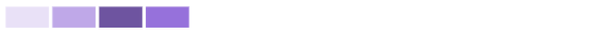

# 了解操作：悬停、单击并拖动以及单击

在本视频中，您将了解到：

* 如何通过将鼠标悬停在图表上来获取更多信息
* 在图表上创建时间范围
* 如何显示其他图表

>[!VIDEO](https://video.tv.adobe.com/v/335044/?quality=12&learn=on)

## 单击图表以了解更多信息

单击图表的某些部分会显示其他图表或图表信息的细分。

* **任务执行计划**—单击项目名称可以查看燃尽图和“正在执行的任务”图表。
* **项目活动**—单击项目名称可展开图表并按用户查看项目活动。
* **项目树形图**—单击项目框可打开燃尽图和“正在执行的任务”图表。
* **团队活动**—单击团队名称可展开图表，以便您可以按用户查看活动。

## 在团队活动中，较深和较浅的颜色意味着什么？

**登录的用户：**&#x200B;紫色框显示主团队的人员在当天登录。颜色越深表示登录人数越多。

**任务状态变化：**&#x200B;粉色框显示主团队的人员在当天更改了任务的状态。阴影颜色越深表示任务状态变化的数量越多。

**完成的任务：**&#x200B;蓝色框显示主团队的人员在当天完成了一项任务。阴影颜色越深表示完成的任务数量越多。

若要了解更多信息，请参阅[通过团队可视化来了解活动](https://experienceleague.adobe.com/docs/workfront/using/reporting/enhanced-analytics/activity-by-team-overview.html?lang=zh-Hans)。
