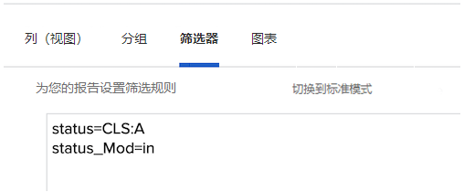

# 了解过滤器的基本文本模式

在此视频中，您将学习：

* 什么是文本模式
* 骆驼的病是什么
* 您可以在报表过滤器中使用一些基本的“即插即用”文本模式

>[!VIDEO](https://video.tv.adobe.com/v/336820/?quality=12)

以下文本模式将排除用户标记为“完成我的部件”的任务。 您只需创建一个任务过滤器，添加所需的任何过滤器规则，然后切换到文本模式，并在过滤器中看到的任何文本模式之后粘贴下面的代码。

```
EXISTS:1:$$OBJCODE=ASSGN  
EXISTS:1:taskID=FIELD:ID  
EXISTS:1:status=DN  
EXISTS:1:status_Mod=notin  
EXISTS:1:assignedToID=$$USER.ID 
```

## 活动：文本模式问题

1. 您如何为标题为“按ID输入”的字段写驼峰大小写？
1. 在“问题”报表中，创建一个过滤器以显示标记为已关闭但待批准的问题。

## 答案

1. “按ID输入”字段的驼峰大小写应如下所示 — enteredByID
1. 文本模式应在问题报表过滤器中如下所示：

   
