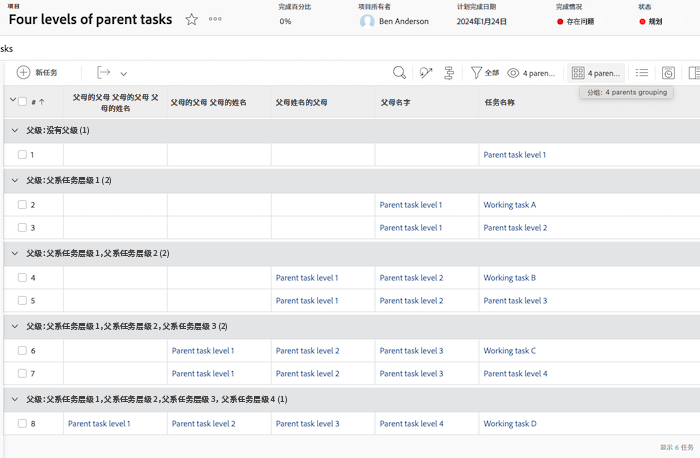
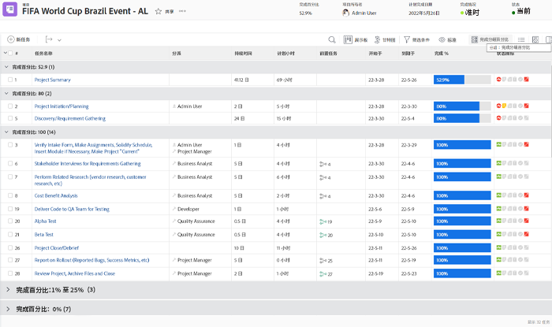
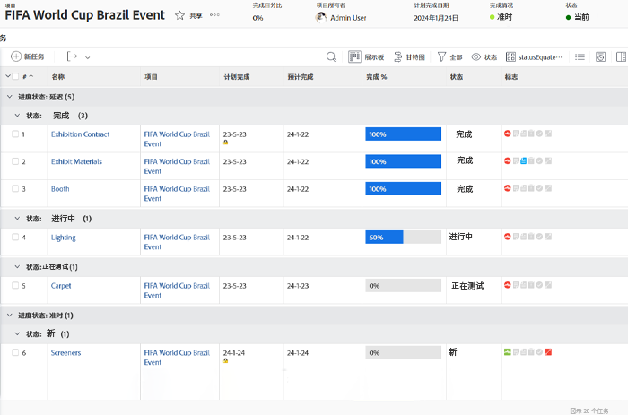
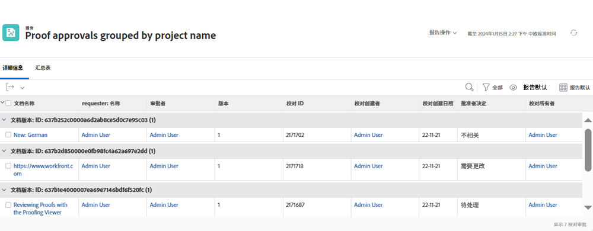
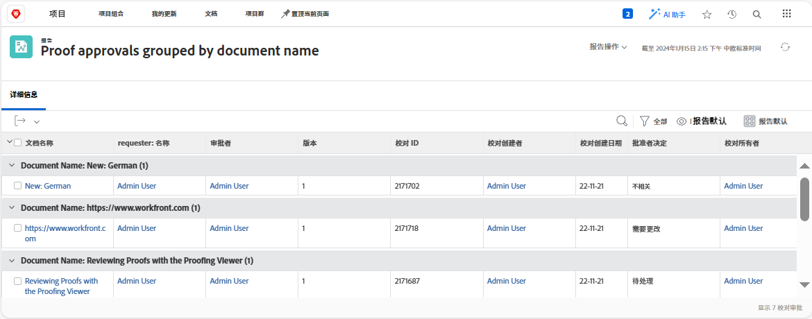

# 了解分组的基本文本模式

>[!IMPORTANT]
>
>先决条件：
>
>* 了解报表元素
>* 了解报表组件
>* 创建基本分组


>[!TIP]
>
>* 要更深入地了解文本模式，我们建议您观看录制的网络研讨会活动 [咨询专家 — 文本模式报告简介](https://experienceleague.adobe.com/docs/workfront-events/events/reporting-and-dashboards/introduction-to-text-mode-reporting.html?lang=en)，时长为一小时。
>* 要进一步了解文本模式，我们建议您查看 [高级报告](https://experienceleague.adobe.com/docs/workfront-learn/tutorials-workfront/reporting/advanced-reporting/welcome-to-advanced-reporting.html?lang=en) 教程，总时长为5.5小时。


在本视频中，您将了解：

* 什么是文本模式
* 什么是驼峰式的
* 您可以在分组中使用的一些基本“即插即用”文本模式

>[!VIDEO](https://video.tv.adobe.com/v/3410641/?quality=12&learn=on)

## 任务 — 4个父项分组

以下文本模式将根据最多四个父级对任务进行分组，并将不存在的父级留空。

```
textmode=true
group.0.name=Parents
group.0.valueexpression=CONCAT({parent}.{parent}.{parent}.{parent}.{name},IF(ISBLANK({parent}.{parent}.{parent}.{parent}.{name}),"",", "),{parent}.{parent}.{parent}.{name},IF(ISBLANK({parent}.{parent}.{parent}.{name}),"",", "),{parent}.{parent}.{name},IF(ISBLANK({parent}.{parent}.{name}),"",", "),IF(ISBLANK({parent}.{name}),"No parent",{parent}.{name}))
group.0.linkedname=parent
group.0.namekeyargkey.0=parent
group.0.namekeyargkey.1=name
group.0.valueformat=string
```




## 任务 — 完成百分比分组

以下文本模式将根据任务的完成百分比对任务进行分组。 对任务进行分组时，任务将属于以下类别之一：

* 0%
* 1%至25%
* 26%至50%
* 51%至75%
* 76%至99%
* 100%

```
group.0.linkedname=direct
group.0.namekey=percentComplete
group.0.valueexpression=IF({percentComplete}<1,"0%",IF({percentComplete}<26,"1% to 25%",IF({percentComplete}<51,"26% to 50%",IF({percentComplete}<76,"51% to 75%",IF({percentComplete}<100,"76% to 99%",IF({percentComplete}=100,"100","***"))))))
group.0.valueformat=doubleAsString
textmode=true
```



## 任务 — statusEquatesWith，然后状态

以下文本模式将依次按statusEquatesWith和status对任务分组。

```
group.0.enumclass=com.attask.common.constants.TaskStatusEnum
group.0.enumtype=TASK
group.0.linkedname=direct
group.0.name=State
group.0.type=enum
group.0.valuefield=statusEquatesWith
group.0.valueformat=val
group.1.enumclass=com.attask.common.constants.TaskStatusEnum
group.1.enumtype=TASK
group.1.linkedname=direct
group.1.namekey=status
group.1.type=enum
group.1.valuefield=status
group.1.valueformat=val
textmode=true
```




## 校对审批 — 按项目名称分组

```
group.0.valueformat=HTML
group.0.valuefield=documentVersion:document:project:name
group.0.displayname=Project Name
```




## 校对审批 — 按文档名称分组

```
group.0.displayname=Document Name
group.0.valuefield=documentVersion:document:name
group.0.valueformat=HTML
```



