# 了解视图的基本文本模式


>[!PREREQUISITES]
>
>* [了解报告要素](https://experienceleague.adobe.com/docs/workfront-learn/tutorials-workfront/reporting/basic-reporting/reporting-elements.html?lang=zh-Hans)
>* [了解报告组件](https://experienceleague.adobe.com/docs/workfront-learn/tutorials-workfront/reporting/basic-reporting/reporting-components.html?lang=zh-Hans)
>* [创建基本视图](https://experienceleague.adobe.com/docs/workfront-learn/tutorials-workfront/reporting/basic-reporting/create-a-basic-view.html?lang=zh-Hans)


>[!TIP]
>
>* 为了更深入地了解文本模式，我们建议观看录制的网络研讨会活动[咨询专家 - 文本模式报告简介](https://experienceleague.adobe.com/docs/workfront-events/events/reporting-and-dashboards/introduction-to-text-mode-reporting.html?lang=zh-Hans)，时长为一小时。
>* 要了解有关文本模式的更多信息，我们建议观看[高级报告](https://experienceleague.adobe.com/docs/workfront-learn/tutorials-workfront/reporting/advanced-reporting/welcome-to-advanced-reporting.html?lang=zh-Hans)教程，总共为五个半小时。
>* 单击此处以访问 [[!UICONTROL API Explorer]](https://developer.adobe.com/workfront/api-explorer/)

在本视频中，您将了解到：

* 什么是文本模式
* 什么是驼峰式拼写
* 您可以在视图中使用一些基本的“即插即用”文本模式

>[!VIDEO](https://video.tv.adobe.com/v/3410571/?quality=12&learn=on)

## 任务 - 4 个父级视图

首先为“任务名称”和“父级名称”创建一列，然后使用以下文本模式创建其他三列。

### 任务 - 父级名称的父级

```
displayname=Parent of Parent Name
linkedname=parent
namekey=view.relatedcolumn
namekeyargkey.0=parent
namekeyargkey.1=name
querysort=parent:parent:name
textmode=true
valuefield=parent:parent:name
valueformat=HTML
```

### 任务 - 父级名称的父级的父级

```
displayname=Parent of Parent of Parent Name
linkedname=parent
namekey=view.relatedcolumn
namekeyargkey.0=parent
namekeyargkey.1=name
querysort=parent:parent:parent:name
textmode=true
valuefield=parent:parent:parent:name
valueformat=HTML
```

### 任务 - 父级名称的父级的父级的父级

```
displayname=Parent of Parent of Parent of Parent Name
linkedname=parent
namekey=view.relatedcolumn
namekeyargkey.0=parent
namekeyargkey.1=name
querysort=parent:parent:parent:parent:name
textmode=true
valuefield=parent:parent:parent:parent:name
valueformat=HTML
```

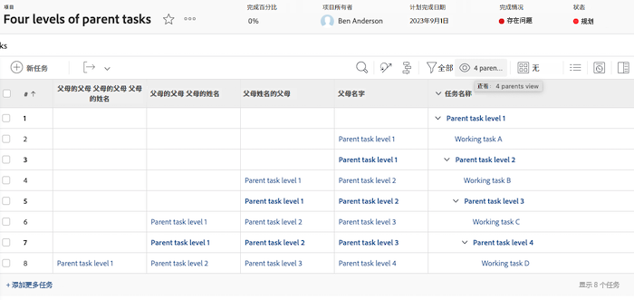

## 用户 - 在用户视图中显示列表的迭代

### 用户 - 所有工作角色

```
displayname=All job roles
listdelimiter=<p>
listmethod=nested(userRoles).lists
textmode=true
type=iterate
valuefield=role:name
valueformat=HTML
```

### 用户 - 显示为“主要”的所有的工作角色

```
displayname=All Job Roles showing primary
listdelimiter=<p> 
listmethod=nested(userRoles).lists 
textmode=true
type=iterate 
valueexpression=IF({user}.{roleID}={role}.{ID},CONCAT("** ",{role}.{name}," **"),{role}.{name})
valueformat=HTML
```

### 用户 - 所有团队

```
displayname=All teams
listdelimiter=<p>
listmethod=nested(teams).lists
textmode=true
type=iterate
valueexpression={name}
valueformat=HTML
```

>[!NOTE]
>
>有一个可通过 UI 访问的“团队”字段，该字段显示所有团队，以逗号分隔，但使用上面的文本模式将在单独的行上显示每个团队。


### 用户 - 所有组

```
displayname=All groups
listdelimiter=<p>
listmethod=nested(userGroups).lists
textmode=true
type=iterate
valuefield=group:name
valueformat=HTML
```

### 用户 - 显示主组的所有组

```
displayname=All groups showing home group
listdelimiter=<p>
listmethod=nested(userGroups).lists
textmode=true
type=iterate
valueexpression=IF({user}.{homeGroupID}={group}.{ID},CONCAT("** ",{group}.{name}," **"),{group}.{name})
valueformat=HTML
```


### 用户 - 直接报告

```
displayname=Direct reports
listdelimiter=<p>
listmethod=nested(directReports).lists
textmode=true
type=iterate
valueexpression={name}
valueformat=HTML
```

### 用户 - 未来 PTO

```
displayname=Future PTO
listdelimiter=<br>
listmethod=nested(reservedTimes).lists
namekey=group.plural
textmode=true
type=iterate
valueexpression=IF({startDate}>$$TODAY,CONCAT({startDate}," - ",{endDate}),"")
valueformat=HTML
width=150
```

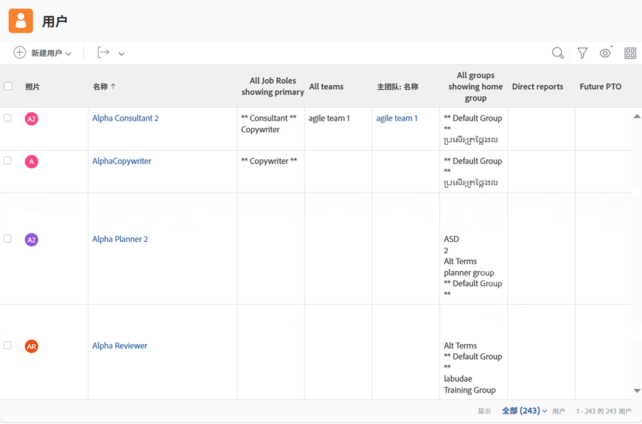

## 任务 - 如何显示任务分配和处理状态

```
displayname=Assignments and Status
listdelimiter=<br>
listmethod=nested(assignments).lists
namekey=group.plural
textmode=true
type=iterate
valueexpression=CONCAT({assignedTo}.{name},IF(ISBLANK({assignedTo}.{name}),"",IF({status}="AA"," - Requested",IF({status}="AD"," - Working"," - Done"))))
valueformat=HTML
width=150
```

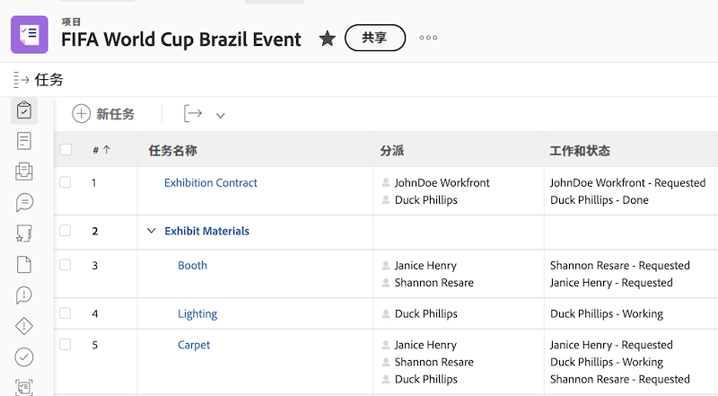


## 任务 - 如何显示多个任务分配的角色和分配情况

### 任务 - 角色 + 小时数

```
displayname=Role+hours
listdelimiter=<li>
listmethod=nested(assignments).lists
textmode=true
type=iterate
valueexpression=CONCAT({role}.{name}," (",round({workRequired}/60,2),")")
valueformat=HTML
```

### 任务 - 分配 + 分配百分比

```
displayname=Assignment+percent
valueexpression=CONCAT({assignedTo}.{name}," (",{assignmentPercent},")")
listdelimiter=<li>
listmethod=nested(assignments).lists
valueformat=HTML
textmode=true
type=iterate
```

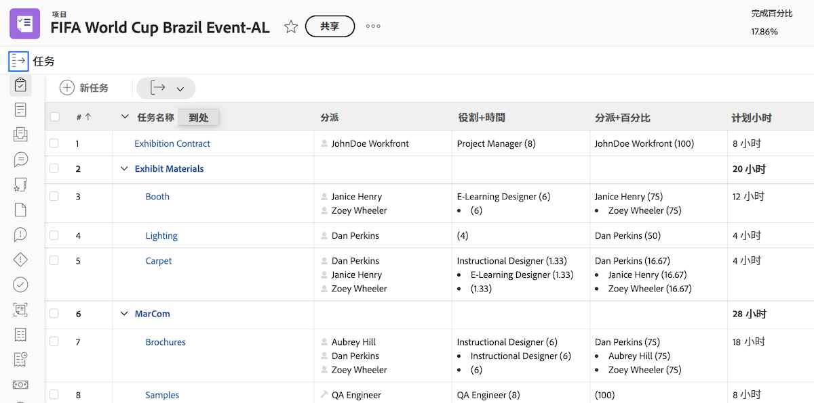

## 任务 - 跨项目的前置任务及后置任务

### 任务过滤器（可选）

**显示当前项目中至少有一个跨项目前置任务或至少有一个跨项目后置任务的所有任务**

```
predecessorsMM:ID_Mod=notblank
predecessorsMM:projectID=FIELD:projectID
predecessorsMM:projectID_Mod=ne
project:statusEquatesWith=CUR
project:statusEquatesWith_Mod=in
OR:1:project:statusEquatesWith=CUR
OR:1:project:statusEquatesWith_Mod=in
OR:1:successorsMM:ID_Mod=notblank
OR:1:successorsMM:projectID=FIELD:projectID
OR:1:successorsMM:projectID_Mod=ne
```

### 任务 - 显示前置任务名称以及项目前置任务的位置

```
displayname=Predecessor names
listdelimiter=<br>
listmethod=nested(predecessors).lists
namekey=group.plural
textmode=true
type=iterate
valueexpression=CONCAT("TASK = ",{predecessor}.{name}," >> PROJECT = ",{predecessor}.{project}.{name})
valueformat=HTML
width=150
```

### 任务 - 显示后置任务名称以及项目后置任务的位置

```
displayname=Successor names
listdelimiter=<br>
listmethod=nested(successors).lists
namekey=group.plural
textmode=true
type=iterate
valueexpression=CONCAT("TASK = ",{successor}.{name}," >> PROJECT = ",{successor}.{project}.{name})
valueformat=HTML
width=150
```

### 任务 - 显示前置任务的预计完成日期

```
displayname=Predecessor projected completion dates
valueformat=atDate
listdelimiter=
textmode=true
width=90
stretch=0
valuefield=predecessor:projectedCompletionDate
type=iterate
listmethod=nested(predecessors).lists
shortview=false
```

### 任务 - 显示前置任务的进度状态

```
displayname=Predecessor progress status
listdelimiter=<br>
listmethod=nested(predecessors).lists
shortview=false
stretch=0
textmode=true
type=iterate
valueexpression=IF({predecessor}.{progressStatus}="OT","On Time",IF({predecessor}.{progressStatus}="LT","Late",IF({predecessor}.{progressStatus}="BH","Behind","At Risk")))
valueformat=HTML
width=90
```

### 任务 - 显示跨项目前置任务项目的完成百分比

```
displayname=Predecessor project percent complete
listdelimiter=<br>
listmethod=nested(predecessors).lists
namekey=group.plural
textmode=true
type=iterate
valueexpression=IF({isCP}=true,CONCAT({predecessor}.{project}.{percentComplete},"%"),"")
valueformat=HTML
width=150
```

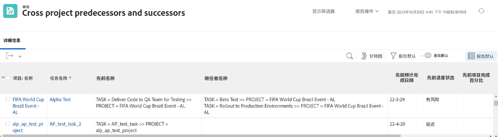


## 任务 - 显示分配的所有人员以及每个由谁分配

```
displayname=All assignees and requesters
listdelimiter=<p>
listmethod=nested(assignments).lists
textmode=true
type=iterate
valueexpression=CONCAT("Assigned To: ",{assignedTo}.{name},"; Requested By: ",{assignedBy}.{name})
valueformat=HTML
```

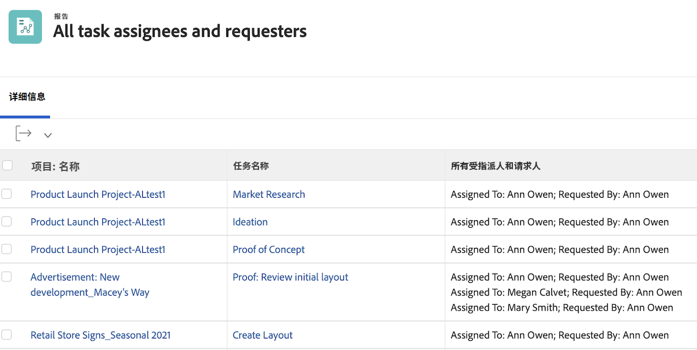

## 任务/项目 - 显示项目或任务中所有自定义表单的迭代

```
displayname=All Forms Assigned
listdelimiter=<p>
listmethod=nested(objectCategories).lists
textmode=true
type=iterate
valuefield=category:name
valueformat=HTML
```

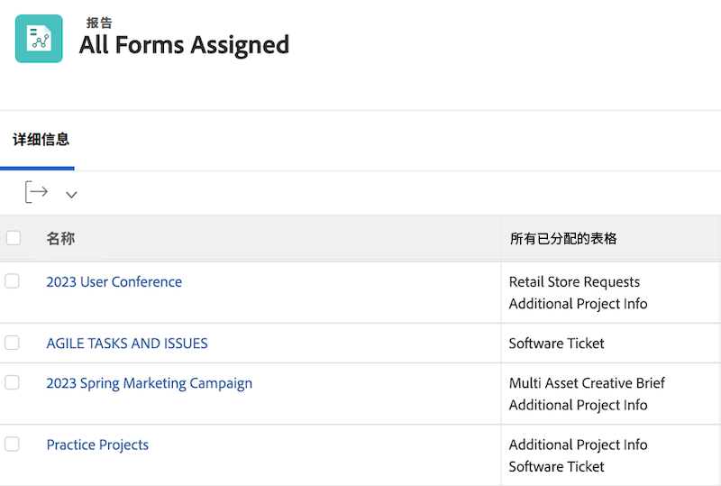


## 项目 - 在项目视图中显示可解析项的所有主要联系人的迭代

```
displayname=Requestor
listdelimiter=<br>
listmethod=nested(resolvables).lists
namekey=group.plural
textmode=true
type=iterate
valuefield=owner:name
valueformat=HTML
width=150
```

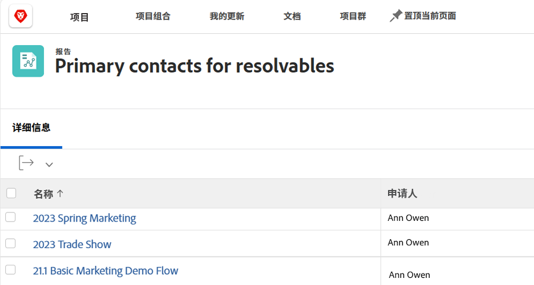

## 项目 - 显示所有项目团队成员的迭代

```
displayname=Project Team Members
listdelimiter=<br>
listmethod=nested(projectUsers).lists
namekey=group.plural
textmode=true
type=iterate
valuefield=user:name
valueformat=HTML
```

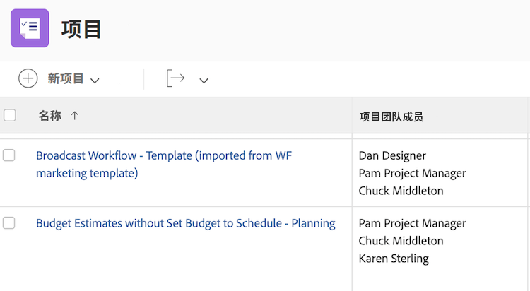

## 项目 - 显示项目所有可解析项的 entryDate 的迭代

```
displayname=Resolvables entry date
linkedname=direct
listdelimiter=<br>
listmethod=nested(project.resolvables).lists
listsort=string(description)
querysort=description
section=0
textmode=true
type=iterate
valuefield=entryDate
valueformat=HTML
```

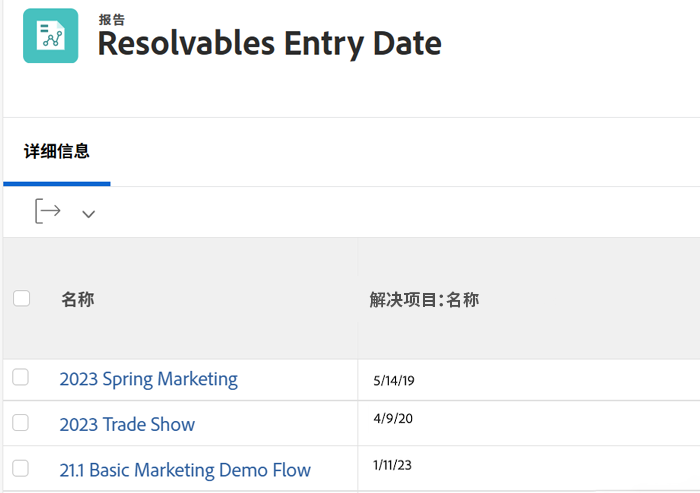

## 项目 - 显示原始项目请求者的主组

```
displayname=Requestor home group
linkedname=direct
namekey=name
querysort=convertedOpTaskOriginator:homeGroup:name
textmode=true
valuefield=convertedOpTaskOriginator:homeGroup:name
valueformat=HTML
```

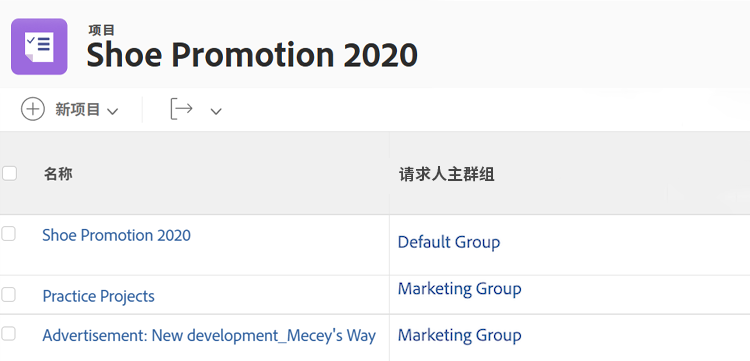

## 项目 - 显示项目是否是请求队列

```
querysort=queueDef:isPublic
valueformat=val
description=0 (None), 1 (Public), 2 (Private), 3 (Company), 4 (Group)
linkedname=direct
textmode=true
enumtype=PROJ
valuefield=queueDef:isPublic
namekey=status
type=enum
enumclass=com.attask.common.constants.ProjectStatusEnum
displayname=Public Selection
```

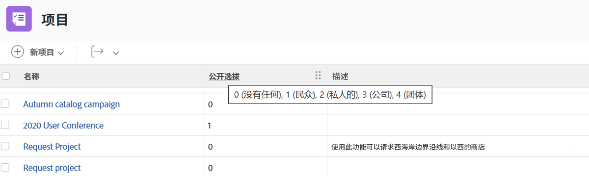

## 问题 - 显示所有解决项目团队成员的迭代

```
displayname=Resolve Project: Team Members
listdelimiter=<br>
listmethod=nested(resolveProject.projectUsers).lists
namekey=group.plural
textmode=true
type=iterate
valuefield=user:name
valueformat=HTML
width=150
```

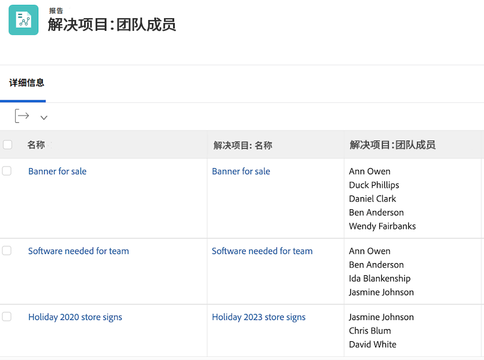

## 问题 - 显示问题主要联系人的所有团队的迭代

```
displayname=Requestor Teams
listdelimiter=<br>
listmethod=nested(owner.teams).lists
namekey=group.plural
textmode=true
type=iterate
valuefield=name
valueformat=HTML
width=150
```

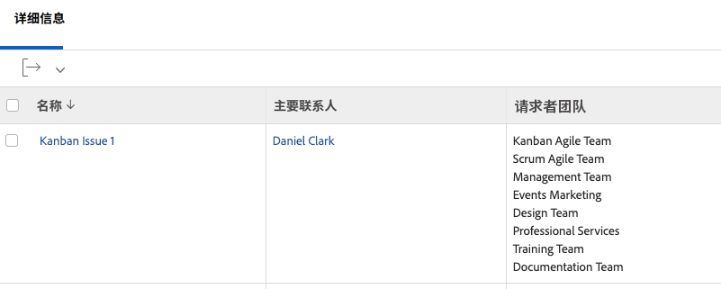

## 文档 - 显示文档报告中文件夹的迭代

```
displayname=Folder
listdelimiter=<br><br>
listmethod=nested(folders).lists
textmode=true
type=iterate
valuefield=name
valueformat=HTML
```

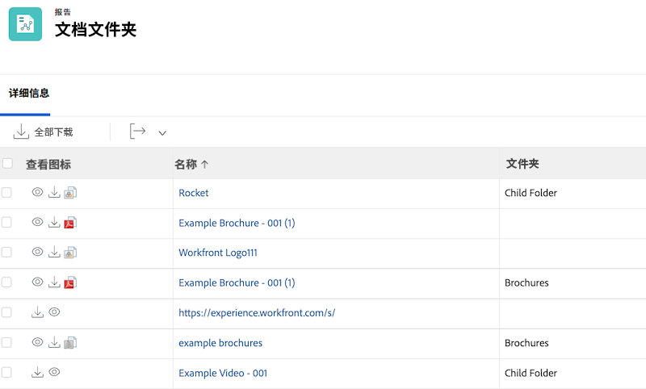

## 文档 - 显示文档报告中父文件夹的迭代

```
displayname=Parent Folder
listdelimiter=<br><br>
listmethod=nested(folders).lists
textmode=true
type=iterate
valuefield=parent:name
valueformat=HTML
```


## 文件 - 文件审批日期

```
displayname=Document approval dates
valueformat=HTML
listdelimiter=<br>
linkedname=direct
textmode=true
listsort=string(description)
valuefield=approvalDate
type=iterate
listmethod=nested(approvals).lists
shortview=false
section=0
```

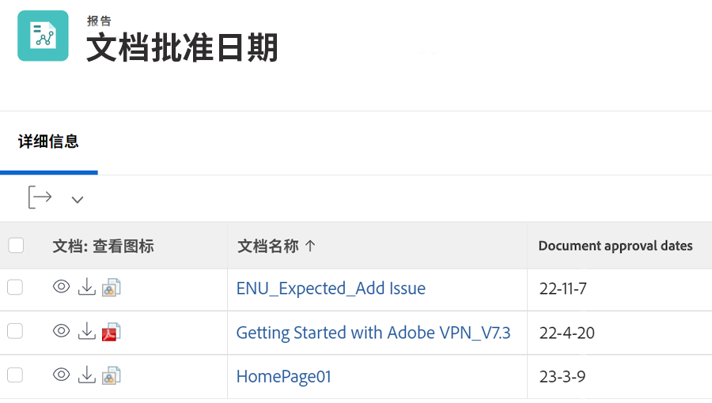

## 验证审批

### 验证审批 - 显示项目名称

```
displayname=Project Name
textmode=true 
valuefield=documentVersion:document:project:name 
valueformat=HTML
```

### 验证审批 - 显示任务名称

```
displayname=Task Name
textmode=true 
valuefield=documentVersion:document:task:name 
valueformat=HTML
```

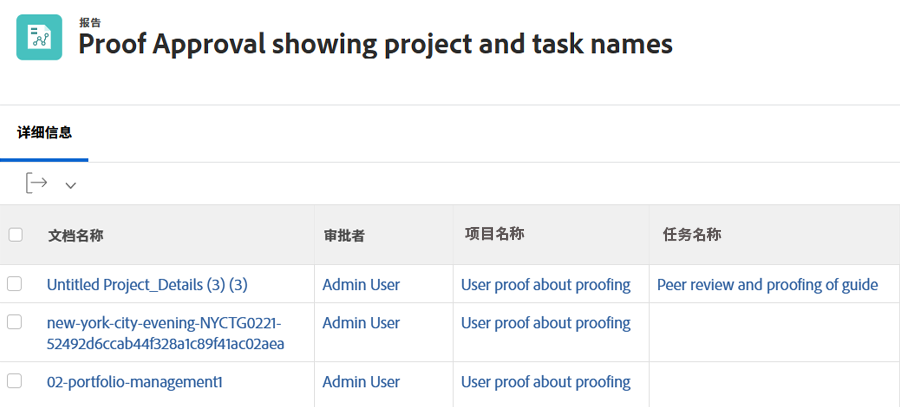
