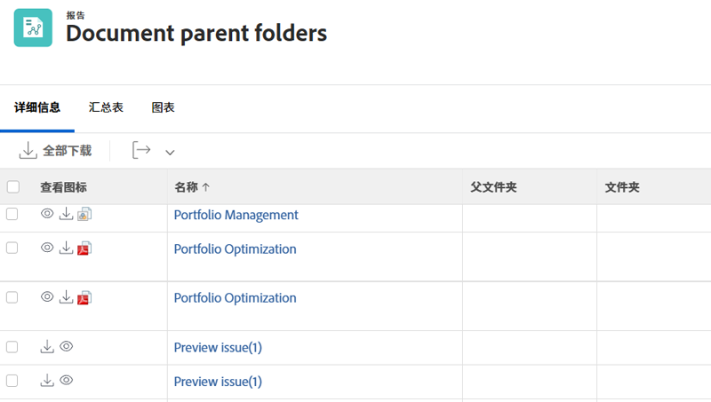

# 了解视图的基本文本模式


>[!IMPORTANT]
>
>先决条件：
>
>* 了解报表元素
>* 了解报表组件
>* 创建基本视图


在此视频中，您将学习：

* 什么是文本模式
* 骆驼的病是什么
* 您可以在视图中使用一些基本的“即插即用”文本模式

>[!VIDEO](https://video.tv.adobe.com/v/3410571/?quality=12)

## 任务 — 4个父视图

首先为“任务名称”和“父名称”创建列，然后使用以下文本模式创建其他三列。

### 任务 — 父名称的父项

```
displayname=Parent of Parent Name
linkedname=parent
namekey=view.relatedcolumn
namekeyargkey.0=parent
namekeyargkey.1=name
querysort=parent:parent:name
textmode=true
valuefield=parent:parent:name
valueformat=HTML
```

### 任务 — 父项名称的父项

```
displayname=Parent of Parent of Parent Name
linkedname=parent
namekey=view.relatedcolumn
namekeyargkey.0=parent
namekeyargkey.1=name
querysort=parent:parent:parent:name
textmode=true
valuefield=parent:parent:parent:name
valueformat=HTML
```

### 任务 — 父项名称父项的父项

```
displayname=Parent of Parent of Parent of Parent Name
linkedname=parent
namekey=view.relatedcolumn
namekeyargkey.0=parent
namekeyargkey.1=name
querysort=parent:parent:parent:parent:name
textmode=true
valuefield=parent:parent:parent:parent:name
valueformat=HTML
```


## 用户 — 在用户视图中显示列表的小版本

### 用户 — 所有作业角色

```
displayname=All job roles
listdelimiter=<p>
listmethod=nested(userRoles).lists
textmode=true
type=iterate
valuefield=role:name
valueformat=HTML
```

### 用户 — 显示主要的所有作业角色

```
displayname=All Job Roles showing primary
listdelimiter=<p> 
listmethod=nested(userRoles).lists 
textmode=true
type=iterate 
valueexpression=IF({user}.{roleID}={role}.{ID},CONCAT("** ",{role}.{name}," **"),{role}.{name})
valueformat=HTML
```

### 用户 — 所有团队

```
displayname=All teams
listdelimiter=<p>
listmethod=nested(teams).lists
textmode=true
type=iterate
valueexpression={name}
valueformat=HTML
```

>[!NOTE]
>
>有一个可通过UI访问的“团队”字段，其中以逗号分隔显示所有团队，但使用上述文本模式将在单独的一行上显示每个团队。


### 用户 — 所有组

```
displayname=All groups
listdelimiter=<p>
listmethod=nested(userGroups).lists
textmode=true
type=iterate
valuefield=group:name
valueformat=HTML
```

### 用户 — 显示主组的所有组

```
displayname=All groups showing home group
listdelimiter=<p>
listmethod=nested(userGroups).lists
textmode=true
type=iterate
valueexpression=IF({user}.{homeGroupID}={group}.{ID},CONCAT("** ",{group}.{name}," **"),{group}.{name})
valueformat=HTML
```


### 用户 — 直接报表

```
displayname=Direct reports
listdelimiter=<p>
listmethod=nested(directReports).lists
textmode=true
type=iterate
valueexpression={name}
valueformat=HTML
```

### 用户 — 将来的PTO

```
displayname=Future PTO
listdelimiter=<br>
listmethod=nested(reservedTimes).lists
namekey=group.plural
textmode=true
type=iterate
valueexpression=IF({startDate}>$$TODAY,CONCAT({startDate}," - ",{endDate}),"")
valueformat=HTML
width=150
```


## 任务 — 如何显示任务分配和处理状态

```
displayname=Assignments and Status
listdelimiter=<br>
listmethod=nested(assignments).lists
namekey=group.plural
textmode=true
type=iterate
valueexpression=CONCAT({assignedTo}.{name},IF(ISBLANK({assignedTo}.{name}),"",IF({status}="AA"," - Requested",IF({status}="AD"," - Working"," - Done"))))
valueformat=HTML
width=150
```


## 任务 — 如何显示多个任务分配的角色和分配

### 任务 — 角色+小时

```
displayname=Role+hours
listdelimiter=<li>
listmethod=nested(assignments).lists
textmode=true
type=iterate
valueexpression=CONCAT({role}.{name}," (",round({workRequired}/60,2),")")
valueformat=HTML
```

### 任务 — 分配+百分比分配

```
displayname=Assignment+percent
valueexpression=CONCAT({assignedTo}.{name}," (",{assignmentPercent},")")
listdelimiter=<li>
listmethod=nested(assignments).lists
valueformat=HTML
textmode=true
type=iterate
```


## 任务 — 跨项目的前置任务和后置任务

### 任务筛选器（可选）

**向我显示至少有一个跨项目前身的所有任务**

```
predecessorsMM:ID_Mod=notblank
predecessorsMM:projectID=FIELD:projectID
predecessorsMM:projectID_Mod=ne
```

### 任务 — 显示前置任务名称和项目前置任务位于

```
displayname=Predecessor names
listdelimiter=<br>
listmethod=nested(predecessors).lists
namekey=group.plural
textmode=true
type=iterate
valueexpression=CONCAT("TASK = ",{predecessor}.{name}," >> PROJECT = ",{predecessor}.{project}.{name})
valueformat=HTML
width=150
```

### 任务 — 显示后继项名称和项目后继项位于

```
displayname=Successor names
listdelimiter=<br>
listmethod=nested(successors).lists
namekey=group.plural
textmode=true
type=iterate
valueexpression=CONCAT("TASK = ",{successor}.{name}," >> PROJECT = ",{successor}.{project}.{name})
valueformat=HTML
width=150
```

### 任务 — 显示前置任务的预计完成日期

```
displayname=Predecessor projected completion dates
valueformat=atDate
listdelimiter=
textmode=true
width=90
stretch=0
valuefield=predecessor:projectedCompletionDate
type=iterate
listmethod=nested(predecessors).lists
shortview=false
```

### 任务 — 显示前置任务的进度状态

```
displayname=Predecessor progress status
listdelimiter=<br>
listmethod=nested(predecessors).lists
shortview=false
stretch=0
textmode=true
type=iterate
valueexpression=IF({predecessor}.{progressStatus}="OT","On Time",IF({predecessor}.{progressStatus}="LT","Late",IF({predecessor}.{progressStatus}="BH","Behind","At Risk")))
valueformat=HTML
width=90
```

### 任务 — 显示跨项目前任项目完成百分比

```
displayname=Predecessor project percent complete
listdelimiter=<br>
listmethod=nested(predecessors).lists
namekey=group.plural
textmode=true
type=iterate
valueexpression=IF({isCP}=true,CONCAT({predecessor}.{project}.{percentComplete},"%"),"")
valueformat=HTML
width=150
```


## 任务 — 小版本，显示分配的所有人员以及分配每个人员的人员

```
displayname=All assignees and requesters
listdelimiter=<p>
listmethod=nested(assignments).lists
textmode=true
type=iterate
valueexpression=CONCAT("Assigned To: ",{assignedTo}.{name},"; Requested By: ",{assignedBy}.{name})
valueformat=HTML
```


## 任务/项目 — 显示项目或任务上所有自定义表单的小版本

```
displayname=All Forms Assigned
listdelimiter=<p>
listmethod=nested(objectCategories).lists
textmode=true
type=iterate
valuefield=category:name
valueformat=HTML
```


## 项目 — 小版本，显示项目视图中已解析的应收款的所有主要联系人

```
displayname=Requestor
listdelimiter=<br>
listmethod=nested(resolvables).lists
namekey=group.plural
textmode=true
type=iterate
valuefield=owner:name
valueformat=HTML
width=150
```


## 项目 — 显示所有项目团队成员的小版本

```
displayname=Project Team Members
listdelimiter=<br>
listmethod=nested(projectUsers).lists
namekey=group.plural
textmode=true
type=iterate
valuefield=user:name
valueformat=HTML
```


## 项目 — 小版本，显示项目所有可解决问题的entryDate

```
displayname=Resolvables entry date
linkedname=direct
listdelimiter=<br>
listmethod=nested(project.resolvables).lists
listsort=string(description)
querysort=description
section=0
textmode=true
type=iterate
valuefield=entryDate
valueformat=HTML
```


## 项目 — 显示原始项目请求者的主组

```
displayname=Requestor home group
linkedname=direct
namekey=name
querysort=convertedOpTaskOriginator:homeGroup:name
textmode=true
valuefield=convertedOpTaskOriginator:homeGroup:name
valueformat=HTML
```


## 项目 — 显示项目是否为请求队列

```
querysort=queueDef:isPublic
valueformat=val
description=0 (None), 1 (Public), 2 (Private), 3 (Company), 4 (Group)
linkedname=direct
textmode=true
enumtype=PROJ
valuefield=queueDef:isPublic
namekey=status
type=enum
enumclass=com.attask.common.constants.ProjectStatusEnum
displayname=Public Selection
```


## 问题 — 显示所有已解决项目团队成员的迭代

```
displayname=Resolve Project: Team Members
listdelimiter=<br>
listmethod=nested(resolveProject.projectUsers).lists
namekey=group.plural
textmode=true
type=iterate
valuefield=user:name
valueformat=HTML
width=150
```


## 问题 — 显示问题主要联系人的所有团队的迭代

```
displayname=Requestor Teams
listdelimiter=<br>
listmethod=nested(owner.teams).lists
namekey=group.plural
textmode=true
type=iterate
valuefield=name
valueformat=HTML
width=150
```


## 文档 — 在文档报表中显示文件夹的迭代

```
displayname=Folder
listdelimiter=<br><br>
listmethod=nested(folders).lists
textmode=true
type=iterate
valuefield=name
valueformat=HTML
```


## 文档 — 在文档报表中显示父文件夹的迭代

```
displayname=Parent Folder
listdelimiter=<br><br>
listmethod=nested(folders).lists
textmode=true
type=iterate
valuefield=parent:name
valueformat=HTML
```



## 单据 — 单据审批日期

```
displayname=Document Approval Dates
valueformat=HTML
listdelimiter=<br>
linkedname=direct
textmode=true
listsort=string(description)
valuefield=approvalDate
type=iterate
listmethod=nested(approvals).lists
shortview=false
section=0
```


## 校对审批

### 校样批准 — 显示项目名称

```
displayname=Project Name
textmode=true 
valuefield=documentVersion:document:project:name 
valueformat=HTML
```

### 校样批准 — 显示任务名称

```
displayname=Task Name
textmode=true 
valuefield=documentVersion:document:task:name 
valueformat=HTML
```


