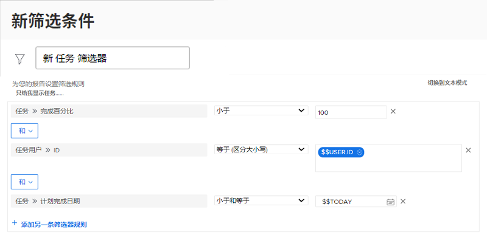

# 使用基于日期的通配符创建过滤器

在本视频中，您将学习如何：

* 知道何时使用基于日期的通配符
* 了解 Workfront 的两个基于日期的通配符之间的区别
* 将基于日期的通配符添加到过滤器
* 使用通配符、属性、运算符和修饰符创建自定义日期
* 使用通配符创建自定义日期范围

>[!VIDEO](https://video.tv.adobe.com/v/3412658/?quality=12&learn=on&captions=chi_hans)

## “使用基于日期的通配符创建过滤器”活动

### 活动问题

1. 如果您想要查看截止日期为昨天或今天的问题，您将如何构建过滤规则？
1. 您将如何构建过滤规则来查找上周到期的项目？
1. 以下过滤规则是您经常使用的任务报告的一部分。您会从这份报告中得到什么类型的结果？

### 答案

1. 过滤规划完成日期在 [!UICONTROL $$TODAY-1d] 和 [!UICONTROL $$TODAY] 之间的问题。
1. 过滤规划完成日期在 [!UICONTROL $$TODAYb-1w] 和 [!UICONTROL $$TODAYe-1w] 之间的项目。
1. 此报告会查找分配给您的尚未完成的任务（即完成百分比低于 100 的任务）以及今天过期或到期的任务。任务规划完成日期的过滤规则表示查看截止日期等于或早于今天日期的任务。
