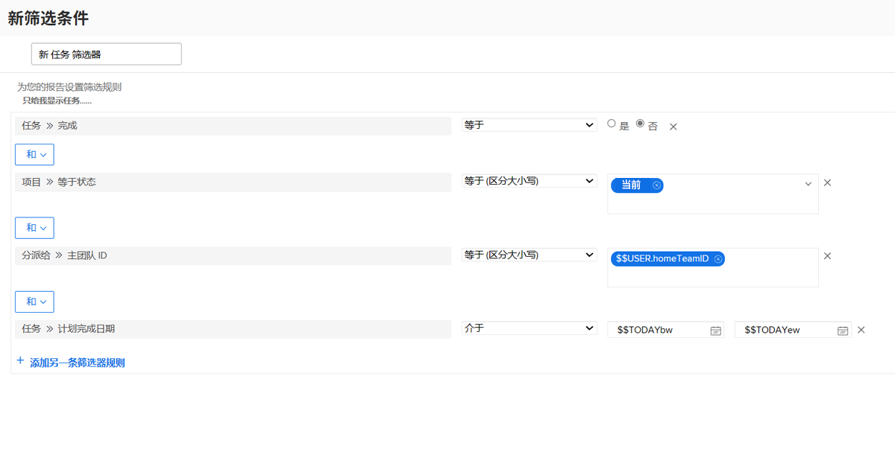

# 使用基于用户的通配符创建过滤器

在此视频中，您将学习如何：

* 了解为何使用通配符
* 使用基于用户的通配符构建过滤器

>[!VIDEO](https://video.tv.adobe.com/v/336810/?quality=12)

>[!TIP]
>
>在生成可查看任务或发出分配信息的过滤器时，请使用分配用户>> ID字段源和名称。  此选项会检查分配给任务或问题的所有用户，而不仅仅是“所有者”或主要代理人。

>[!TIP]
>
>即使您自己构建过滤器，也使用$$USER.ID（而不是您的名称）。 这样，如果有人看到您正在运行的过滤器并说“与我共享该过滤器”，则该过滤器已经设置，以便每个使用该过滤器的人都能够看到自己的信息。

>[!TIP]
>
>使用基于用户的通配符时，必须始终使用“等于”筛选器限定符。

## 活动

你这周有点多余的时间，所以你想看看你团队里是否有人可以在任务上得到一些帮助。 创建任务筛选器以查找本周到期但尚未完成的任务。

## 回答

你帮助队友真是太棒了！ 在设置与下图类似的过滤器后，您将找到任务：

* 尚未完成(即，他们没有 [!UICONTROL Complete] 等于 [!UICONTROL Complete]);
* 这是在 [!UICONTROL Current] 状态（毕竟，您不希望为尚未启动的项目查找任务）；
* 根据Workfront团队设置的定义，分配给您主团队中的某个人；
* 并且完成日期为本周的某个时候（此规则使用预建的日期过滤器来定义“本周”）。

如果需要进一步限制列表，您可能需要添加一些其他过滤器。 例如，您可能想要添加一个筛选规则，以检查您的团队所用的特定项目或项目组合。
