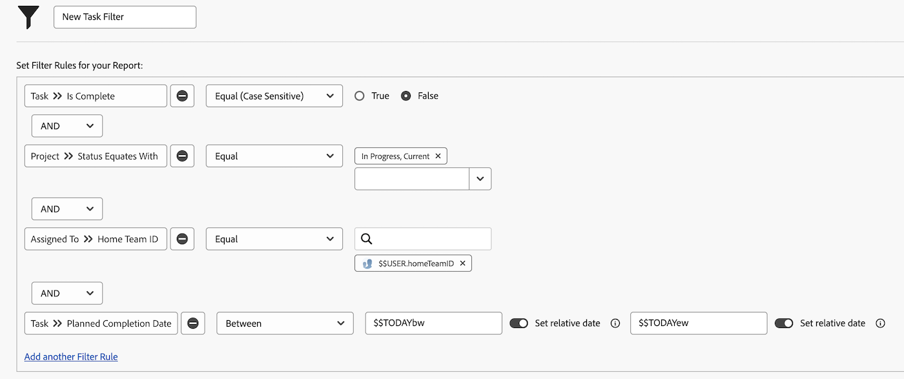

# 使用基于用户的通配符创建过滤器

在本视频中，您将学习如何：

* 了解为什么使用通配符
* 使用基于用户的通配符构建过滤器

>[!VIDEO](https://video.tv.adobe.com/v/336810/?quality=12&learn=on&enablevpops=0)

>[!TIP]
>
>构建能够查看任务或问题分配信息的过滤器时，请使用“任务用户” >> “ID 字段源和名称”。  此选项检查分配给任务或问题的所有用户，而不仅仅是“所有者”或主要受让人。

>[!TIP]
>
>即使在为自己构建过滤器时也请使用 $$USER.ID（而不是您的名字）。 这样，如果有人看到您正在运行的过滤器并要求与其共享，此时过滤器已经设置完毕，因此每个使用它的人都可以看到自己的信息。

>[!TIP]
>
>使用基于用户的通配符时，您必须使用“等于”过滤限定符。

## “使用基于用户的通配符创建过滤器”活动

### 活动 1

本周您有一些额外的时间，因此我们建议您看一看团队中是否有人在完成任务时需要帮助。 创建任务筛选器以查找分配给您的主团队的本周到期且尚未完成的任务。

### 答案 1

您能帮助您的队友真是太棒了！ 设置如下图所示的筛选条件后，您会找到以下任务：

* 尚未完成的任务（这意味着他们没有处于 [!UICONTROL Complete] 状态或状态相当于 [!UICONTROL Complete]）；
* 在项目中处于 [!UICONTROL Current] 状态（毕竟，您不会想要查找尚未启动的项目的任务）；
* 根据 Workfront 团队设置的定义，分配给您主团队中某个人的任务；
* 以及完成日期为本周某个时间的任务（此规则使用预建的日期过滤器来定义“本周”）。

如果您需要进一步限制列表，则可能需要添加一些额外的过滤器。 例如，您可能需要添加一个过滤规则来查看您的团队使用的特定程序或项目组合。
