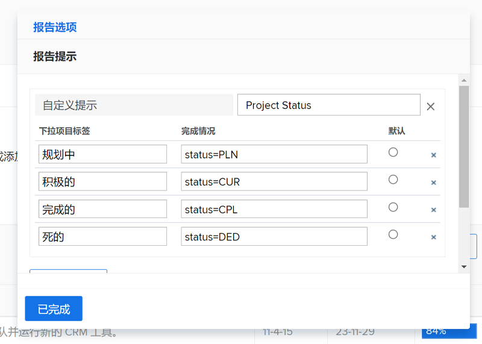
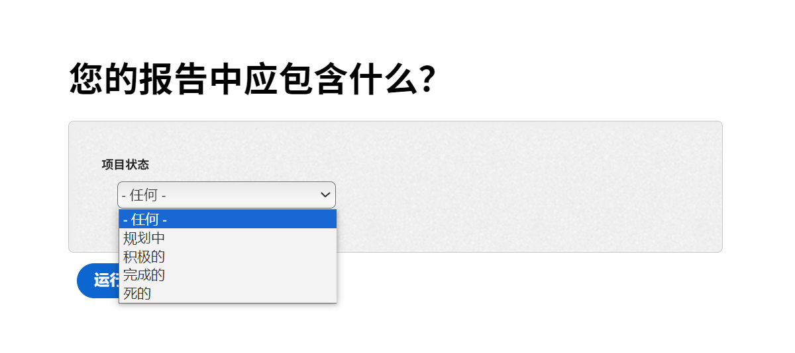
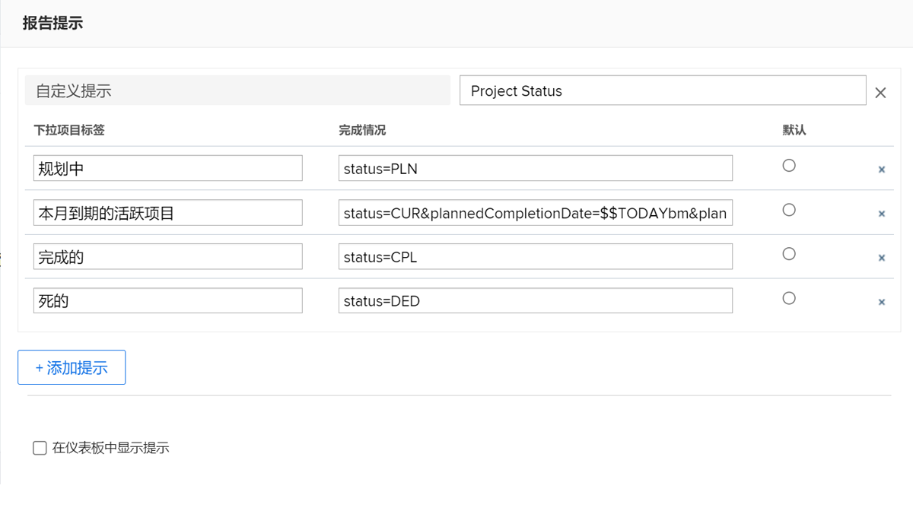

# 创建自定义提示

在本视频中，您将了解到：

* 什么是自定义提示
* 如何使用文本模式创建自定义提示
* 您可以在报告中使用的一些示例

>[!VIDEO](https://video.tv.adobe.com/v/3412688/?quality=12&learn=on&captions=chi_hans)

## “创建自定义提示词”活动


### 活动：创建自定义提示

1. 创建自定义提示，其中在提示下拉菜单中显示以下项目状态：
   * 规划中
   * 目前
   * 已完成
   * 已停止
1. 修改提示以显示本月到期的当前项目。

### 答案

1. 您的自定义提示应与此类似，并具有以下文本模式：

   

   保存自定义提示后，提示下拉菜单应如下所示：

1. 自定义提示中的文本模式应如下所示：



```
   status=CUR&plannedCompletionDate=$$TODAYbm&plannedCompletionDate_Mod=between&plannedCompletionDate_Range=$$TODAYem 
```

活动提示的下拉标签应该更新，以反映代码中的更改，如下所示：


