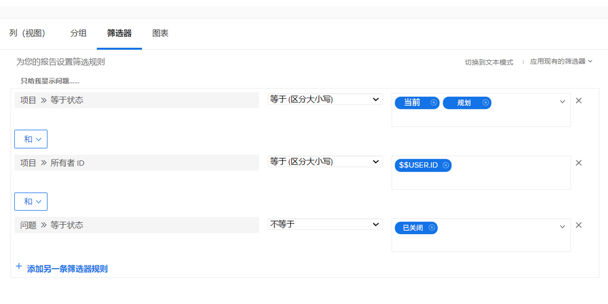
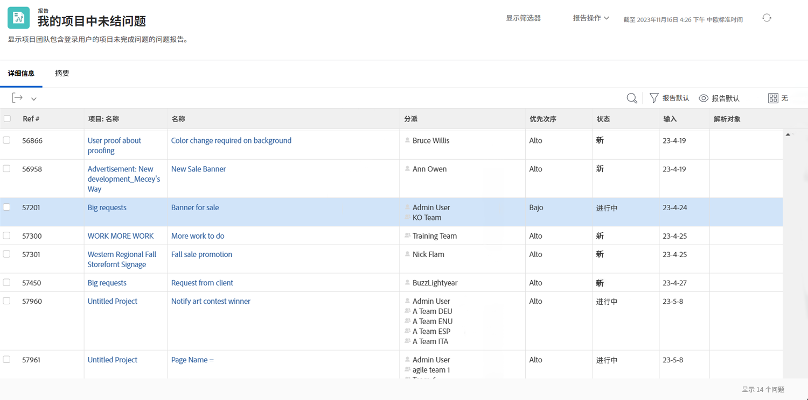

# 了解内置问题过滤器

在此视频中，您将：

* 查看内置问题过滤器，以了解它们的构建方式
* 了解一些有用的问题报告元素
* 了解如何创建您自己的问题过滤器

>[!VIDEO](https://video.tv.adobe.com/v/3412676/?captions=chi_hans&quality=12&learn=on&enablevpops=0)

## “了解内置问题过滤器”活动

### 活动：创建问题报告

您想要查看您负责的所有活动项目中仍需要解决的所有问题，其中包括与解决对象有关的问题。创建一个问题报告，并将其命名为“我负责的项目中未解决的问题”。

### 答案

过滤器应如下所示：

在“我的未决问题”内置过滤器中，过滤规则之一排除了存在解决对象的任何问题。这是因为您不必担心这些问题。有人已经创建了一个可以解决这些问题的项目、任务或问题，因此无须担心。但它们尚未解决，因此在我们的示例中，我们会将其包括在内，以便于识别并检查它们的情况。

为此，您需要在视图选项卡中添加“问题 >> 解决对象”列。这会显示解决对象的名称（如果有），无论是项目、任务还是问题均是如此。单击该名称会将您带到相应的解决对象。

建议您根据项目名称对列表进行分组。

报告应如下所示：

