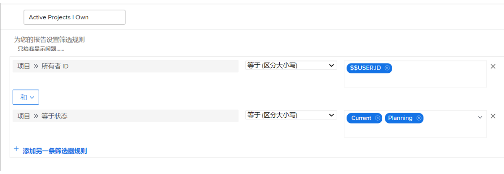

# 探索内置项目过滤器

在本视频中，您将学习如何：

* 查看内置项目过滤器，以了解它们的构建方式
* 使用您所学到的知识创建您自己的项目过滤器

>[!VIDEO](https://video.tv.adobe.com/v/3412664/?captions=chi_hans&quality=12&learn=on&enablevpops=0)

## “了解内置项目过滤器”活动

### 活动：创建一个项目过滤器

您要能看到您拥有的所有活动项目，其中“活动”表示项目状态等于“规划中”或“当前”。在“项目”区域中，创建一个名为“我拥有的活动项目”的项目过滤器。

### 答案

您的过滤器应该如下所示：

您可以加入其他过滤规则，例如在特定项目群或项目组合中查找项目。当您这样做时，Workfront 建议您将过滤器重命名为相应的描述性名称，例如“我在营销项目组合中拥有的活跃项目”。
