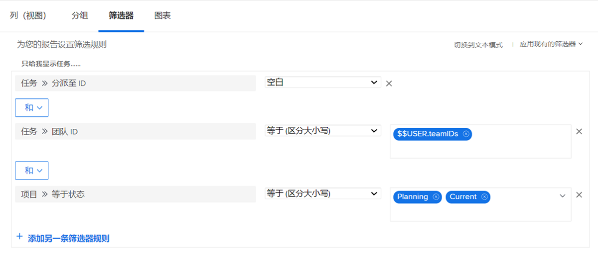
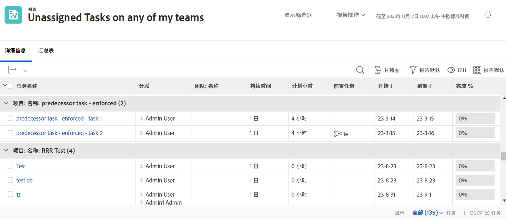

# 了解内置任务过滤器

在本视频中，您将执行以下操作：

* 查看内置任务筛选器以了解其构建方式
* 了解一些有用的任务报告元素
* 了解如何创建自己的任务过滤器

>[!VIDEO](https://video.tv.adobe.com/v/336818/?quality=12)

## 活动：创建任务报告

您希望确保您知道分配给您的某个团队的任务，但尚未有人同意处理该任务。 创建名为“我的任何团队中的未分配任务”的任务报告。

## 答案

以下是筛选器的外观：

设置列视图，以包含您感兴趣或希望能够内联编辑的字段。 例如，您可以包含一个“工作总揽”列，这样您就可以直接从报表将团队成员分配给任务。

您可能需要根据分配给每个任务的团队名称对列表进行分组。

以下是报表的外观：

