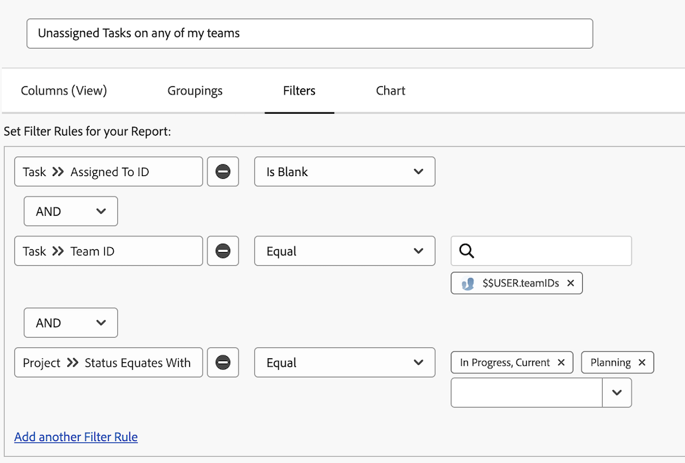
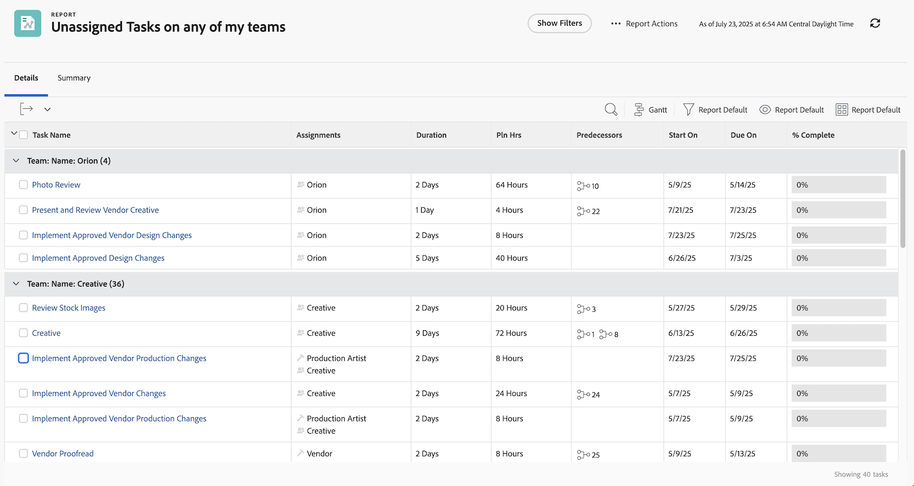

# 探索内置任务过滤器

在此视频中，您将：

* 查看内置任务过滤器，以了解它们的构建方式
* 了解一些有用的任务报告元素
* 了解如何创建您自己的任务过滤器

>[!VIDEO](https://video.tv.adobe.com/v/336818/?quality=12&learn=on&enablevpops=0)

## “了解内置任务过滤器”活动

### 活动：创建任务报告

您需要确保自己知道分配给您的某个团队但尚未有人同意执行的任务。 创建一个名为“我的所有团队中未分配的任务”的任务报告。

### 答案

过滤器应如下所示：

设置列视图，以包含您感兴趣或希望能够进行内联编辑的字段。 例如，您可以包含“分配”列，以便可以直接从报告中为团队成员分配任务。

建议您根据分配到每个任务的团队名称对列表进行分组。

以下是报表可能呈现的外观：

