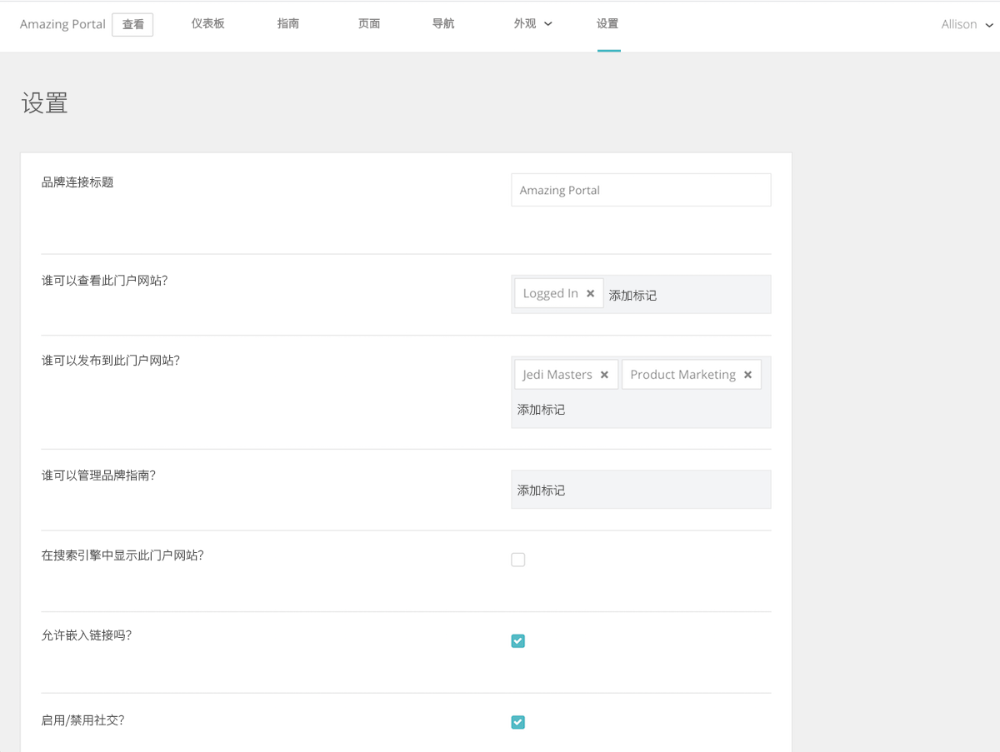

# 在 [!UICONTROL Brand Connect] 中建立系统设置

[!UICONTROL Brand Connect] 设置可控制谁可以查看门户、谁可以将内容发布到门户以及谁可以管理品牌指南。

要访问设置，请登录 [!UICONTROL Workfront DAM]。

1. 单击导航栏中的&#x200B;**设置图标**，然后选择 **[!UICONTROL Brand Connect]**。或单击导航栏中的 **[!UICONTROL Brands]**。
1. 然后单击 [!UICONTROL Brand Connect] 面板右上角的 **[!UICONTROL Edit]** 选项。如果您的组织有多个 [!UICONTROL Brand Connects]，请确保您编辑的是正确一个。

如果您对这些设置有任何疑问，请咨询您的 [!UICONTROL Workfront] 顾问。

* **[!UICONTROL Brand Connect]名称**——命名 [!UICONTROL Brand Connect]（或更改其名称）。
* **谁可以查看此门户？**——设置可以查看 [!UICONTROL Brand Connect] 的组。例如，如果您添加 [!UICONTROL Logged In] 组，那么所有登录的用户都可以看到该门户。但是，文件夹权限仍然适用，因此即使用户可以看到该门户，他们也无法访问资源，除非授予 [!UICONTROL Logged In] 组对该文件夹的权限。
* **谁可以发布到此门户？**——设置可以将资源发布到 [!UICONTROL Brand Connect] 的组。这些是投稿人组。他们只能发布他们有权访问的项目。
* **谁可以管理品牌指南？**——设置可以管理品牌指南的组。并非只有管理员用户才能管理这些指南。您可以设置一个投稿人组来编辑这些指南。
* **在搜索引擎中显示此门户？**——当人们在互联网上进行搜索时，您希望显示 [!UICONTROL Brand Connect] URL 吗？
* **是否允许可嵌入链接？**——[!UICONTROL Brand Connect] 可以提供可嵌入链接吗？这将在 [!UICONTROL Share] 菜单中添加一个 [!UICONTROL Get Links] 面板，图为资源提供可嵌入的链接。
* **启用/禁用社交？**—如果启用社交（选中该框），用户可以对资源进行点赞和评论。
* **启用/禁用下载和查看计数？**—启用后，用户可以查看资源的下载次数以及评论数量。
* **最初隐藏方面**—隐藏出现在 [!UICONTROL Assets] 页面左侧面板中的元数据搜索过滤器。
* **Lightbox 标签**—为 [!UICONTROL Lightboxes] 选择一个标签—— [!UICONTROL Lightbox]、[!UICONTROL Collection]、[!UICONTROL Favorites] 或 [!UICONTROL Favourites]。
