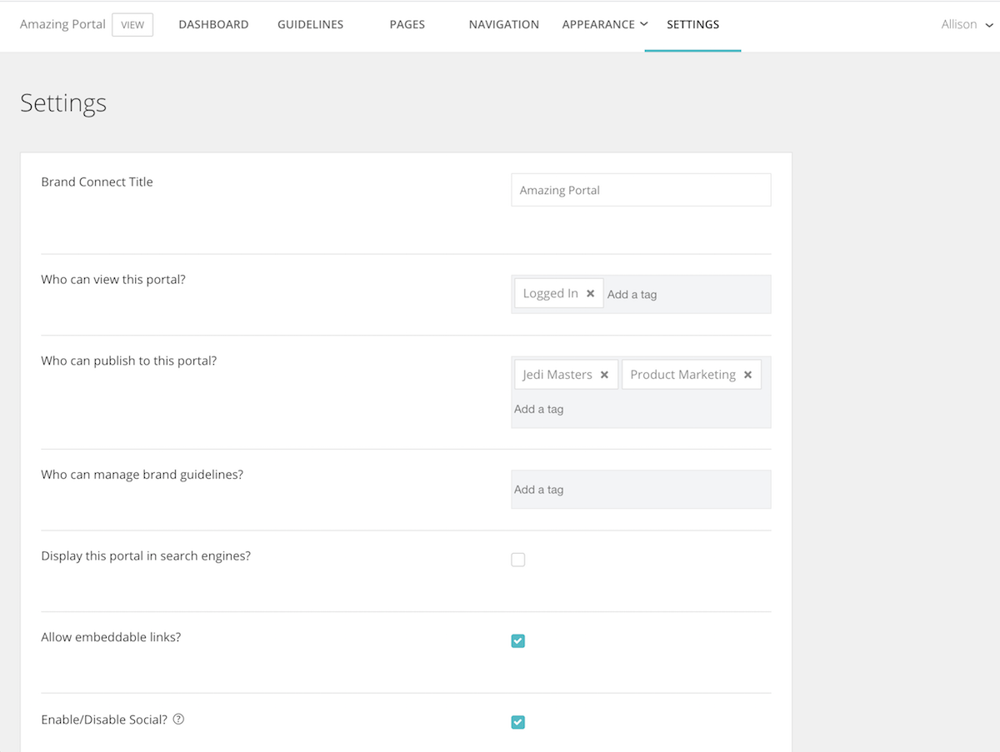

# 在 [!UICONTROL Brand Connect] 中建立系统设置

[!UICONTROL Brand Connect] 设置可控制谁可以查看门户、谁可以将内容发布到门户以及谁可以管理品牌指南。

要访问设置，请登录 [!UICONTROL Workfront DAM]。

1. 单击导航栏中的&#x200B;**设置图标**，然后选择 **[!UICONTROL Brand Connect]**。 或单击导航栏中的 **[!UICONTROL Brands]**。
1. 然后单击 [!UICONTROL Brand Connect] 面板右上角的 **[!UICONTROL Edit]** 选项。 如果您的组织有多个 [!UICONTROL Brand Connects]，请确保您编辑的是正确一个。

如果您对这些设置有任何疑问，请咨询您的 [!UICONTROL Workfront] 顾问。

* **[!UICONTROL Brand Connect]名称**——命名 [!UICONTROL Brand Connect]（或更改其名称）。
* **谁可以查看此门户？** — 设置可以查看[!UICONTROL Brand Connect]的组。 例如，如果您添加 [!UICONTROL Logged In] 组，那么所有登录的用户都可以看到该门户。 但是，文件夹权限仍然适用，因此即使用户可以看到该门户，他们也无法访问资源，除非授予 [!UICONTROL Logged In] 组对该文件夹的权限。
* **谁可以发布到此门户？** — 设置可以将资源发布到[!UICONTROL Brand Connect]的组。 这些是投稿人组。 他们只能发布他们有权访问的项目。
* **谁可以管理品牌指南？** — 设置可以管理品牌指南的组。 并非只有管理员用户才能管理这些指南。 您可以设置一个投稿人组来编辑这些指南。
* **在搜索引擎中显示此门户？** — 是否希望在Internet上运行搜索时显示[!UICONTROL Brand Connect] URL？
* **允许可嵌入的链接吗？** — 可嵌入的链接是否来自[!UICONTROL Brand Connect]？ 这将在 [!UICONTROL Share] 菜单中添加一个 [!UICONTROL Get Links] 面板，图为资源提供可嵌入的链接。
* **是否启用/禁用Social？** — 如果启用Social（选中框），则用户可以在资产上查看和评论。
* **启用/禁用下载和查看计数？** — 启用后，用户可以查看某个资源已下载的次数以及它包含多少注释。
* **最初隐藏方面**—隐藏出现在 [!UICONTROL Assets] 页面左侧面板中的元数据搜索过滤器。
* **Lightbox 标签**—为 [!UICONTROL Lightboxes] 选择一个标签—— [!UICONTROL Lightbox]、[!UICONTROL Collection]、[!UICONTROL Favorites] 或 [!UICONTROL Favourites]。
