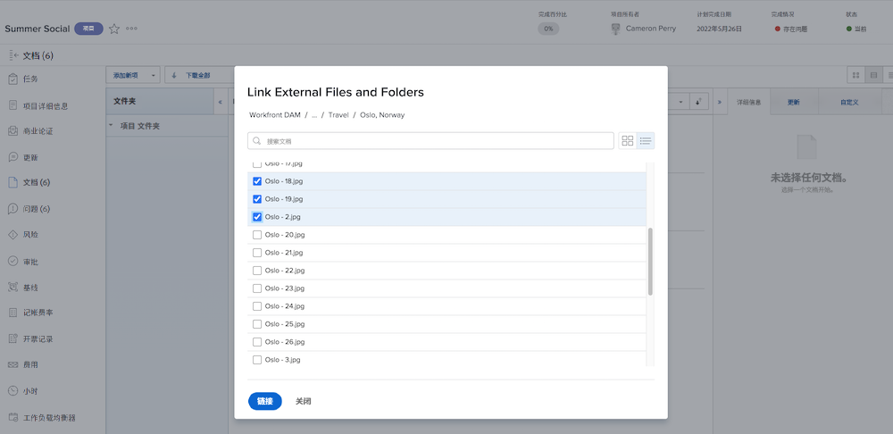

# 在 [!DNL Workfront] 中添加 [!UICONTROL Workfront DAM] 链接

首先设置这两个系统之间的连接。

1. 登录 [!DNL Workfront]。
1. 打开项目、任务或问题，然后单击 **[!UICONTROL Documents]** 选项卡。
1. 单击 **[!UICONTROL Add New]** 按钮并从下拉菜单中选择 **[!UICONTROL From Workfront DAM]**。
1. 在出现的 [!UICONTROL Workfront DAM] 授权框中输入您的登录名和密码。
1. 接下来，单击 **[!UICONTROL Yes]**，允许 [!DNL Workfront] 访问 [!UICONTROL DAM] 帐户。
1. 如果需要，刷新页面以更新对 [!UICONTROL Workfront DAM] 的访问权限。

现在，您可以在 [!DNL Workfront] 中放置一个与 [!UICONTROL Workfront DAM] 项目之间的链接。

1. 登录 [!DNL Workfront]。
1. 打开项目、任务或问题，然后单击 **[!UICONTROL Documents]** 选项卡。
1. 单击 **[!UICONTROL Add New]** 按钮并从下拉菜单中选择 **[!UICONTROL From Workfront DAM]**。
   ![[!UICONTROL Add New] 下拉菜单中 [!UICONTROL From Workfront DAM] 选项的图像](assets/01-contributor-from-workfront-dam.png)
1. 您在 [!UICONTROL Workfront DAM] 中有权访问的文件和文件夹的列表在窗口中出现。

1. 找到您要查找的资源并选中其旁边的框。默认视图是一个列表，但您可以通过窗口右上角的图标切换到缩略图视图。

   

1. 单击 **[!UICONTROL Link]** 按钮。[!UICONTROL Workfront DAM] 文件的链接出现在文档列表中。会有一个图标指示此链接。

   ![[!DNL Workfront] 的文档列表中出现的 [!UICONTROL Workfront DAM] 文件链接的图像。](assets/03-contributor-linked-in-wf.png)
