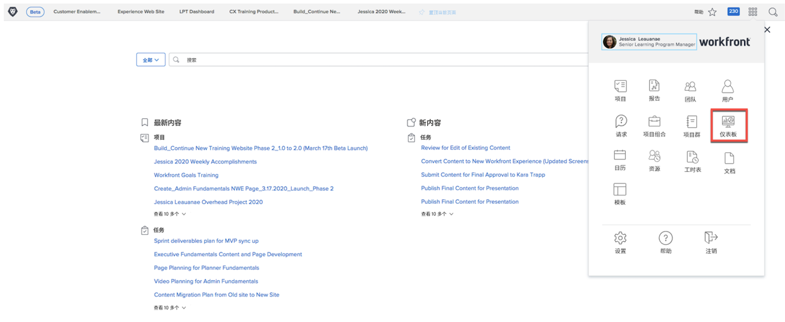
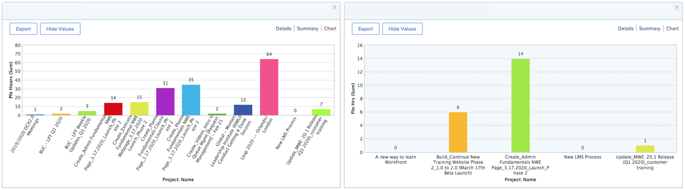

# 面向高管的Workfront

## 报告和仪表板

### 报告

Workfront中的报告是更快做出更好决策的支柱。 您可以随时随地查看它们 — 在项目区域、人员区域或任务登陆页面上。

主管和主管可以导航到报告区域，以查看包含特定信息的自定义报告。 为了提高对最重要报表的可见性，Workfront使用功能板。

### 仪表板

通过使用功能板，领导可以查看并快速深入了解其组织当前正在处理的工作的任何部分。该功能板只是报告集合，提供了领导定期查看可能需要的信息。 仪表板是完全可自定义的，因此使用Workfront的任何人都可以查看对他们而言重要的工作。

单击右上角主菜单图标中的仪表板，以访问仪表板区域。

领导者可以从左侧面板导航中访问他们可用的不同仪表板。

* **所有仪表板**：显示您或其他用户已创建并且您至少有权查看的仪表板。
* **我的仪表板**：显示您已构建的仪表板。
* **共享报告面板**：显示由其他用户创建并与您共享的仪表板。

通过仪表板，领导者能够查看“成本、收入和预算”等项目，了解其团队正在处理的重要项目和未完成的问题。 他们还可以看到有风险的项目，以及需要执行批准的项目列表。

Workfront中的报告有助于提高员工的责任感。 利用报告的关键在于为组织使用报告的方式建立明确的工作流。 确保每个人都清楚地了解哪些报表用于衡量成功情况。

Workfront中仪表板中的报告示例

## 提出请求

在许多组织中，开始新项目、开发新产品或创建交付项的第一步是在Workfront中提出请求。 您可以跟踪请求的进度，并在需要时提供其他信息。

在本视频中，您将了解如何：

* 导航到请求区域
* 提出请求
* 查看您提交的请求

>[!VIDEO](https://video.tv.adobe.com/v/336092/?quality=12&learn=on)
