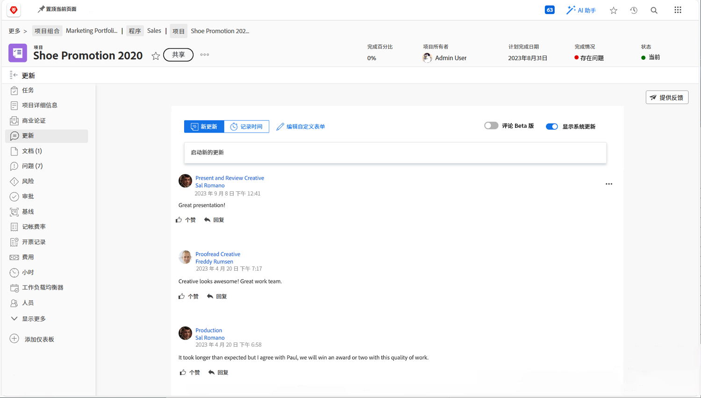
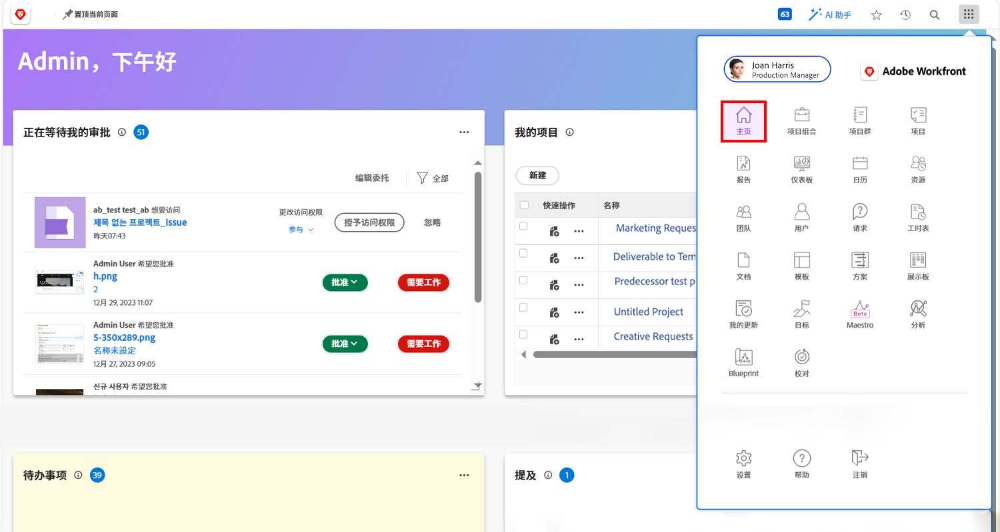

# 面向高管的Workfront

作为高管，Adobe Workfront可以：

* 通过通知您有关的工作进度 **报告和仪表板**
* 给你一个简单的方法 **使用更新与项目利益相关者沟通**
* 给你一个简单的方法 **提出工作请求**
* 给你一个简单的方式来看到 **等待您审批的项目**

## 报告和仪表板

### 报告

Workfront中的报告是更快做出更好决策的支柱。 您可以随时随地查看这些任务 — 在项目区域、人员区域或任务登陆页面上。

领导和管理人员可以导航到报告区域，查看包含特定信息的自定义报告。 为了增加最重要的报表的可见性，Workfront使用功能板。

### 仪表板

通过使用仪表板，领导可以查看并快速深入查看其组织当前正在处理的工作的任何部分。该仪表板只是报告集合，其中提供了领导可能需要定期查看的信息。 功能板是完全可自定义的，因此任何使用Workfront的人都可以查看对他们而言重要的工作。

单击右上角主菜单图标中的功能板以访问功能板区域。

领导者可以从左侧面板导航中访问他们可用的不同仪表板。

* **所有仪表板**：显示您或其他用户已创建且您有权至少查看的仪表板。
* **我的仪表板**：显示您已构建的仪表板。
* **共享报告面板**：显示由其他用户创建并与您共享的仪表板。

借助仪表板，领导者能够查看“成本、收入和预算”等情况，了解团队正在处理的重要项目和未完成的问题。 他们还可以看到有风险的项目，以及需要执行审批的项目列表。

Workfront中的报表有助于推动员工问责制。 利用报告的关键是建立明确的工作流，以了解贵组织如何使用报告。 确保每个人都清楚地了解哪些报表用于衡量成功情况。

Workfront中仪表板中的报告示例

## 使用更新与项目利益相关者沟通

与项目本身的项目团队通信，以便轻松访问所有项目通信。

## 提出请求

在许多组织中，启动新项目、开发新产品或创建交付项的第一步是在Workfront中提出请求。 您可以跟踪请求的进度，并在需要时提供其他信息。

在本视频中，您将学习如何：

* 导航到请求区域
* 提出请求
* 查看您提交的请求

>[!VIDEO](https://video.tv.adobe.com/v/336092/?quality=12&learn=on)

## 等待您审批的项目

在 [!UICONTROL Home] 您可以轻松地查找等待您审批的项目。

