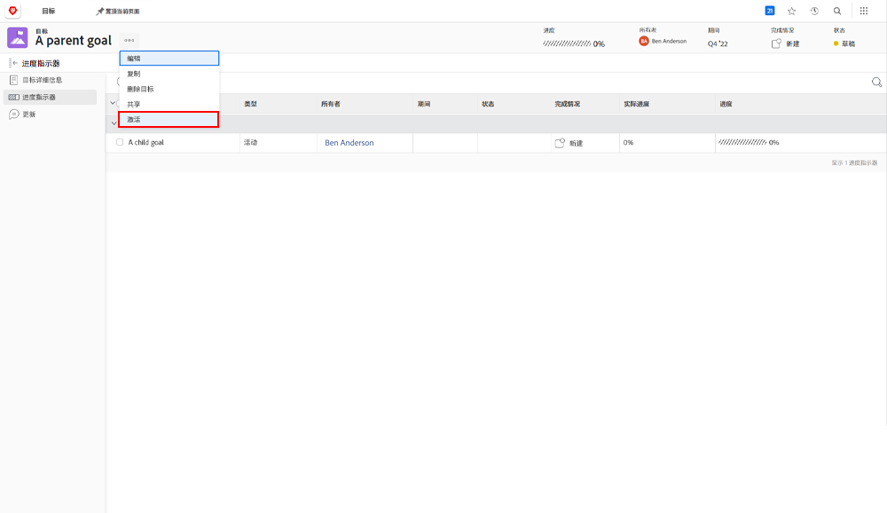

# 通过将一个目标与另一个目标对齐来实现激活

当您调整两个目标时，一个将成为父目标，另一个将成为子目标。父目标可以有多个子目标，但子目标只能与一个父目标对齐。

1. 通过单击 [!UICONTROL Goal List] 中的子目标名称来打开子目标。默认情况下，您会发现自己在 [!UICONTROL Goal Details] 选项卡中。
1. 单击 [!UICONTROL Parent goal information] 面板中的 [!UICONTROL +Add] 按钮。

   ![[!UICONTROL Goal Details] 选项卡的屏幕快照](assets/06-workfront-goals-align-goals.png)

1. 开始在 [!UICONTROL Parent goal] 字段中输入所需父目标的名称，然后当它出现在列表中时选择它。列表中仅会显示同一时期或未来时期的目标。

   ![[!UICONTROL Goal Details] 面板的屏幕快照，其中显示了 [!UICONTROL Parent goal information] 面板](assets/07-workfront-goals-align-to.png)

1. 单击 [!UICONTROL Save Changes]。

将一个目标与另一个目标对齐时会创建一个子目标。将子目标视为有助于实现组织或团队父目标的个人目标。子目标可以激活并影响父目标的进展。

## 现在请激活父目标

现在您已经创建了一个子目标，它将成为父目标的进度指示器。单击父目标名称旁边的三点菜单时，您会看到“激活”选项。

