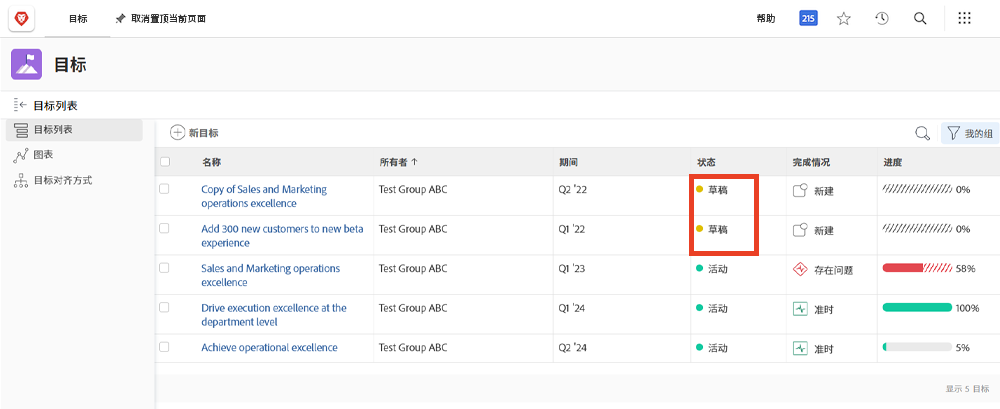
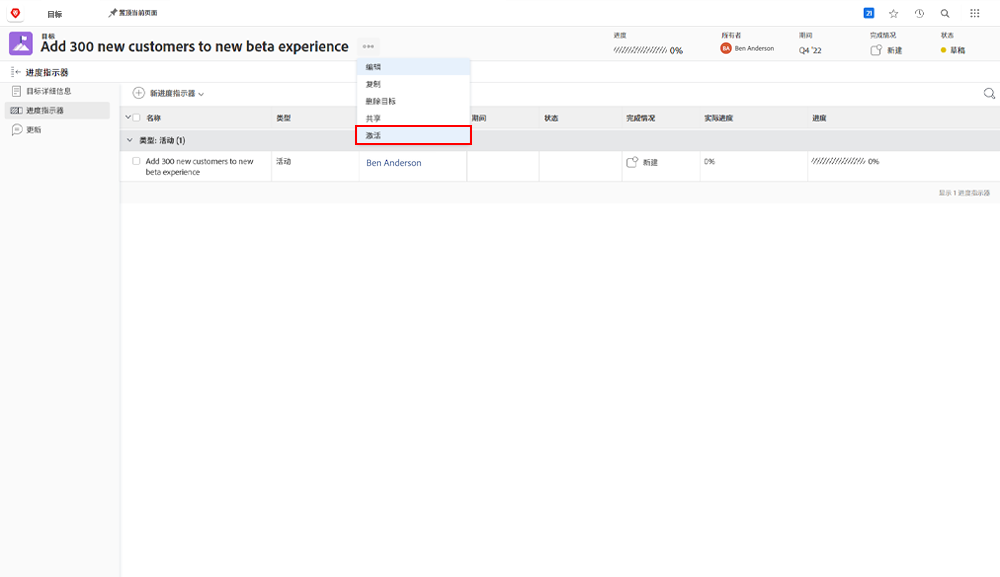

# 激活目标

现在您已经创建了目标，让我们来激活它们吧！当您创建目标时，它会保存为 [!UICONTROL Draft] 状态。在激活之前，[!UICONTROL Draft] 目标不属于目标管理的一部分。激活后，它们就会切换到 [!UICONTROL Active] 状态，并会在仪表板中显示其进度，以及它们如何与总体策略保持一致。[!UICONTROL Active] 状态下的目标与进度指示器相关联——这通常是活动、结果、项目或一致的目标（父-子级目标关系）。

## 激活目标需要进度指标

在继续往下之前，了解 [!DNL Workfront Goals] 中使用的进度指标非常重要。进度指标是 [!DNL Goals] 中用于计算目标进度的对象。进度指标为一致的目标、结果、活动和项目。稍后您将会更详细地了解到这些内容。目前，重要的是要了解必须将一致的目标、结果、活动和项目添加到目标中才能激活它。

要添加进度指标，请打开目标并选择左侧的进度指标选项卡，然后选择旁边的新进度指标下拉菜单。

与其他进度指标相比，项目有些独特，因为它们会被视为一种活动。活动可以分为两种类型——手动进度条和项目。因此，项目也能推动进度。尽管所有类型的进度指标都可以连接到父级目标，但请务必记住，管理它们的方式存在差异。

## 现在请激活目标

当您的目标至少有一个进度指标时，单击目标名称旁边的三点菜单时，您会看到“激活”选项。

