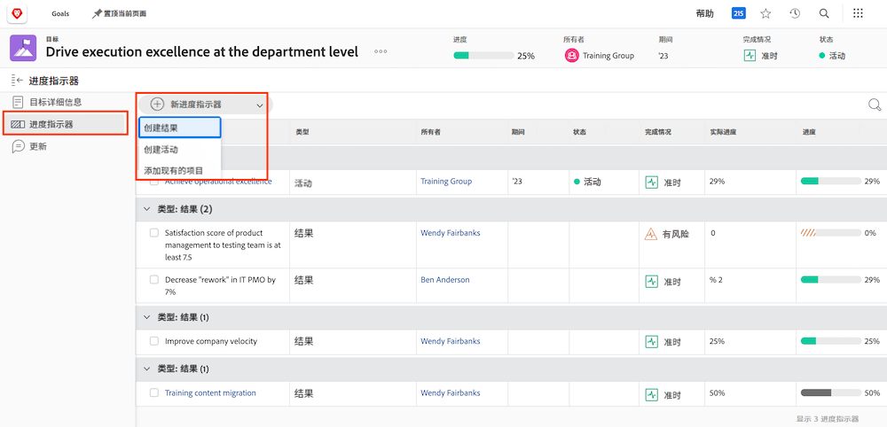

# 在中激活目标 [!DNL Workfront]

现在，您已创建目标，让我们激活它们！ 当您创建目标时，它保存在 [!UICONTROL Draft] 状态。 [!UICONTROL Draft] 在激活目标之前，目标不会包含在目标管理中。 激活后，它们将切换到 [!UICONTROL Active] 状态和在功能板中显示进度，以及它们如何与整体策略保持一致。 目标 [!UICONTROL Active] 状态与进度指示器相关联 — 通常是活动、结果、项目或一致目标（子父目标关系）。

## 需要进度指标来激活目标

在继续之前，必须了解 [!DNL Workfront Goals]. 进度指标是 [!DNL Goals] 用于计算目标的进度。 进度指标是一致的目标、结果、活动和项目。 你稍后会详细了解这些。 目前，必须了解必须将一致的目标、结果、活动和项目添加到目标中才能激活它。

要添加进度指示器，请打开目标并选择左侧的“进度指示器”选项卡，然后选择目标旁边的“新建进度指示器”下拉菜单。

与其他进展指标相比，项目有些独特，因为它们被视为一种活动。 活动可分为两种类型：手动进度条和项目。 因此，项目也会推动进展。 尽管所有类型的进度指标都可以与父目标相关联，但务必要记住，在管理这些指标的方式上存在差异。

## 现在，激活目标

当您的目标上至少有一个进度指示器时，当您单击目标名称旁边的三个圆点菜单时，将看到激活选项。

