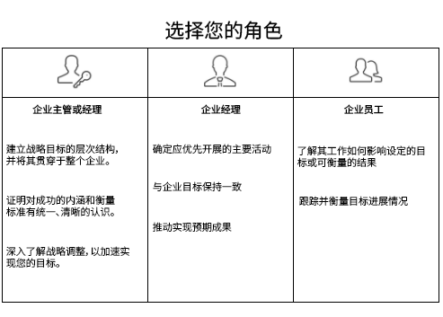

# 设置 [!UICONTROL Workfront Goals] （对于您的组织）

*此分区用于 [!DNL Workfront] 负责为用户设置Workfront目标的系统管理员。*

为确保您的组织能够快速前进，您必须确保工作执行与公司战略保持一致。 [!DNL   Goals] 协调战略、目标和工作，以推动整个组织的执行并产生可衡量的业务成果。

目标最佳实践从顶层公司目标开始，然后逐级细分到组、团队和单个级别。 由此产生的目标必须与实现公司优先目标的目标一致，有助于和支持实现公司优先目标。 In [!DNL Workfront]，目标由指示如何实现这些目标的结果或活动支持。

## [!DNL Workfront Goals] 清单

在您可以访问之前，必须满足以下条件 [!DNL   Goals]：

* 贵组织必须购买 [!DNL Workfront Goals] 许可证，以及 [!DNL Workfront] 许可证。
* 您的组织必须使用 [!DNL Workfront] 体验界面。 [!DNL Workfront Goals] 在经典中不可用 [!DNL Workfront] 界面。
* 您的 [!DNL Workfront Goals] 必须向用户授予访问权限 [!DNL Workfront Goals] 访问级别。
* 您必须分配一个布局模板，该模板包括 [!DNL Workfront Goals] 区域，用户可通过该区域访问该功能。

## 谁可以使用 [!DNL Workfront Goals]

虽然个人投稿人通常有个人目标，我们建议使用 [!DNL Workfront Goals] 支持贵组织实现战略目标的工作。 应鼓励组织中的每个人制定与公司整体战略相一致的目标，并与他们的日常活动联系起来。

请阅读下面的角色描述，并确定您的角色是什么 [!DNL Workfront Goals].

主管和管理人员可以使用 [!DNL Workfront Goals] 至：

* 建立跨越整个企业的战略目标层次结构。
* 提供对成功的外观和衡量方式的统一、清晰的愿景。
* 深入了解可以作出哪些战略调整来加快实现目标。

个人参与者可以使用 [!DNL Workfront Goals] 到：

* 使他们的目标与公司的总体战略计划相协调。
* 衡量其与战略目标相关的进展和成就。
* 根据需要调整个人目标，以与业务方向保持一致。

