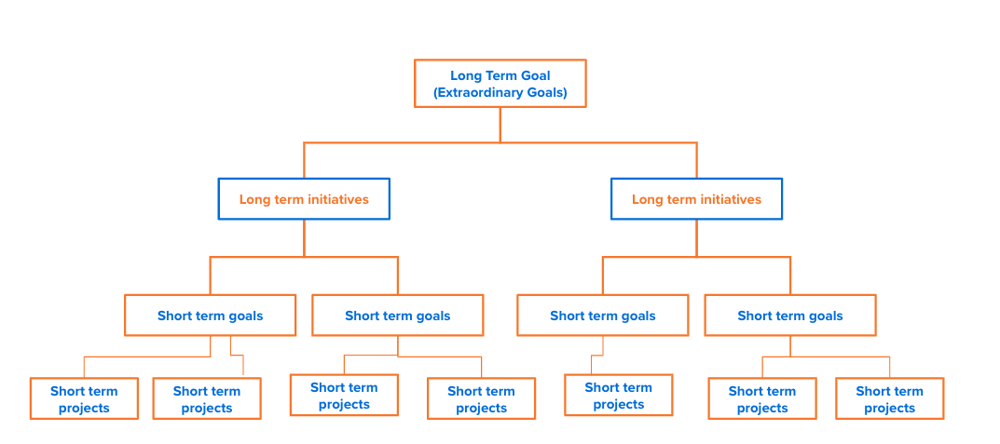

# 为您的组织制定愿景和战略

在本视频中，您将了解到：

* 在规划阶段阐明“内容”和“原因”
* 目标示例
* 影响范围

>[!VIDEO](https://video.tv.adobe.com/v/335185/?quality=12&learn=on)

## 规划定期检查和维护的节奏

规划仪式、活动和监控的节奏与计划本身的细节内容同样重要。现代规划是连续且波动的。您应该预见到在这一过程中会进行监控、审查和调整。这样做有助于您纠正方向，以达到预期的结果。

实现一致性取决于创造一种可以放弃无影响力的工作的文化。通常情况下，我们的项目及其完成情况会成为我们唯一的关注点。尽管我们可能会推动工作的完成，但这可能会导致最终无法实现最终目标，因为工作与最初的结果不再相关。

长期/短期规划周期的传统节奏可以是 12 个月/3 个月。或者也可以是 6 个月/1 个月或其他时间。

在为您的组织确定适当的节奏时，请考虑这些概念。

* 在当今的商业环境中，内部和外部因素更加不稳定，并且经常发生变化。为了从战略上解决这些因素，对短期目标的审查和调整应至少每 3 个月进行一次。

* 每次回顾都应该包括反思过去的成就和努力的时间，并评估未来的业务轨迹。问问您自己和您的团队......我们还在正轨上吗？

下图说明了这种节奏的关系和周期性，这不仅是长期和短期目标之间的关系和周期性，也是长期和短期工作努力之间的关系和周期性。

1. **长期目标**&#x200B;通常是更广泛的企业或组织目标，这些目标需要 12 个月或更长时间才能实现。它们不太可能通过单一的工作努力来完成。大多数公司和组织在层级的顶部都有几个层次的长期目标，其将短期目标统一在一个广泛的最终目标下。
1. **长期计划**&#x200B;代表对为推动运营而制定的工作努力的高水平估计。这些计划最终会被细化为更加可消耗的工作成果（即项目、任务等）。虽然这些通常是较长时间的工作努力，例如 12 个月或更长，但在某些情况下，这些可能是与相同结果相对应的几个长达 6 个月或更长的计划的组合。
1. **短期目标**&#x200B;是您的员工和团队设定的目标，旨在实现更多里程碑式的成果。所有这些分段成就都有助于实现您的企业或组织的长期目标。
1. **短期项目**&#x200B;指实现短期目标所需的更狭义的工作范围。这些项目可能是一次性项目，也可能是作为更广泛计划一部分的项目。

<!--
Your turn graphic
-->

让我们花一点时间练习并应用您到目前为止所学到的知识。首先为您的团队制定一组初始目标。您可能听说过这称为级联目标或目标层级。请注意，它们都是如何与长期目标联系起来并从那里级联的。请不要担心在这个阶段过于明确。这是您展示所有目标的机会。随着我们的进展，我们会进一步完善这些目标。

