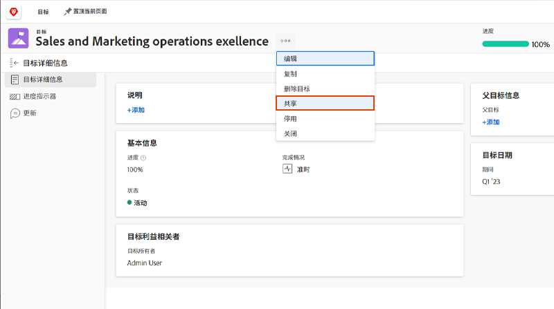

# 传达目标状态

现在，您已使用 [!UICONTROL Check-ins]，请稍等后退一步，并鸟瞰您正在处理的目标以及这些目标与团队、组和公司目标的关系。 就目标的进度和状态与他人沟通是保持一致的一个重要部分。

有多种方法可让适当的人员了解您的目标。 您可以通过以下方式开始：

* 共享和报告您的目标
* 设置视图 [!UICONTROL Pulse] 创建和查看单个目标更新的流
* 利用 [!UICONTROL Graphs] 部分，以全面了解目标进度

## 共享目标

您可以共享您创建的目标或由您有权管理的其他人创建的目标。 您不能与组、团队或公司共享目标。 如果您拥有目标的“管理”权限，则可以更改目标创建者的目标权限。 默认情况下，创建目标的人员具有“管理”权限，但您可以将其更改为“查看”。

1. 单击 [!DNL Goals] 打开区域 [!UICONTROL Goal Details] 的上界。

1. 单击目标名称旁边的3个圆点图标，然后单击 [!UICONTROL **共享**]. 的 [!UICONTROL Goal Access] 框中。

   

1. 执行以下操作之一：

   * 选择 [!UICONTROL Manage system-wide] 设置，以向系统中对具有“编辑”访问权限的每个人授予“管理”权限 [!DNL Goals] 通过 [!DNL Workfront] 访问级别。 默认情况下，所有新目标都将取消选中此选项。
   * 开始键入您要提供的用户的名称 [!UICONTROL Manage] 的权限 [!UICONTROL Give Manage access to] 框中。 当名称显示在列表中时，选择该名称。

1. 单击 [!UICONTROL **共享**]. 在 [!UICONTROL Access to Manage] 字段 [!UICONTROL Goal Details] 的上界。

## 目标信息报告

您可以构建目标报表或项目报表，其中包含有关 [!DNL Workfront]. 有多种方法可在报表中查看目标信息。

* 在“报表”区域中创建目标报表。 您可以在目标报表中显示有关目标的各种信息(例如：名称、所有者、日期、进度等)，包括以下内容：

   * **目标层次结构** — 显示所有父目标以及它们彼此的连接方式。
   * **是公司目标** — 指示贵组织是否被指定为目标的所有者。
   * **所有者类型** — 指示目标的所有者是用户、团队还是群组。

* 创建显示目标信息的项目报表，包括以下内容：
   * **目标层次结构** — 显示所有父目标以及它们彼此的连接方式。
   * **目标** — 这是一个集合字段，用于显示与项目关联的所有目标。
   * **链接目标的数量** — 与项目关联的目标数。
