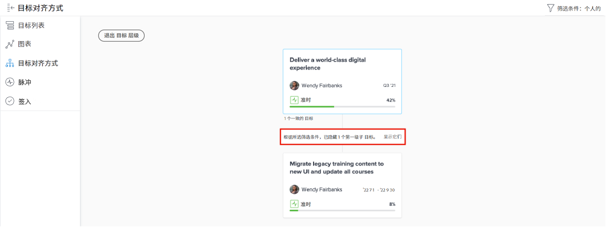

# 查看单个目标更新

在本视频中，您将了解如何：

* 在中查看您的各个目标 [!UICONTROL Pulse] 更新流

>[!VIDEO](https://video.tv.adobe.com/v/335200/?quality=12&learn=on)

## 筛选Pulse流中的信息

您可能会注意到，有时您会在 [!UICONTROL Pulse] 流或可能不是正确的信息。 过滤信息源中的信息，查看您想要或需要的内容。

1. 单击 [!UICONTROL **Pulse**] （在左侧面板中）。
1. 单击 [!UICONTROL **筛选条件**] 图标。
1. 选择要作为筛选依据的选项。 默认情况下，将应用“全部”过滤器，并显示系统中的所有目标。 您可以执行以下操作之一：

   * 选择任何预定义过滤器 — 列在 [!UICONTROL Saved] 过滤器面板的部分 — 为所有者显示目标(即， [!UICONTROL All]， [!UICONTROL Personal]， [!UICONTROL My teams]， [!UICONTROL My groups]、和 [!UICONTROL Company])。
   * 将鼠标悬停在筛选器的名称上，然后单击 **编辑** 图标进行自定义，并添加特定的用户、团队、组名称或组织名称。
   * 单击 [!UICONTROL **新建筛选器**] 要创建新筛选器，请从要自定义的选项列表中进行选择，并按 [!UICONTROL Period]， [!UICONTROL Status]， [!UICONTROL Progress]，和/或 [!UICONTROL Owner].

   ![的图像 [!UICONTROL Filters] 面板位于 [!DNL Workfront Goals]](assets/18-workfront-goals-pulse-stream.png)

**注意：** 您的筛选选择将被保留，并且的其他部分中的信息也将被保留 [!DNL Goals] 将根据此信息显示。 您可以在的各个部分中查找和筛选目标 [!DNL Goals] 区域位于 [!DNL Workfront]：

* [!UICONTROL Goal List]
* [!UICONTROL Graphs]
* [!UICONTROL Pulse]
* [!UICONTROL Goal Alignment]. 在此部分中，您可以临时显示与您应用的过滤器不匹配的目标，以便获取所有对齐目标的全貌。 单击 [!UICONTROL **显示它/显示它们**] 选项（如果选定过滤器隐藏了目标）。

  
