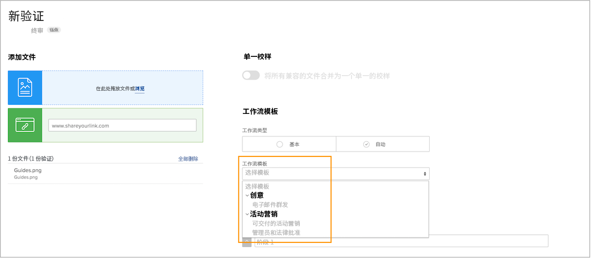
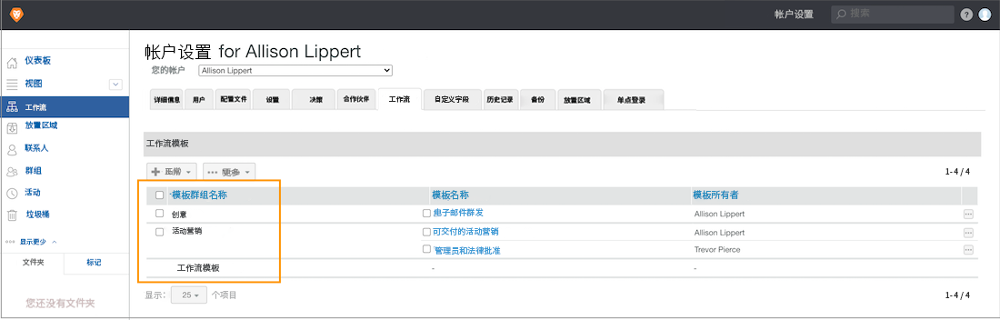

# 创建模板组来组织自动化工作流模板

在开始制作自动化工作流模板之前，[!DNL Workfront] 建议您通过创建模板组来帮助组织模板。当您有多个团队或部门在使用验证功能时，组（将其视为保存各种模板的桶）非常有用，因为它们有助于保持模板井井有条，以便分配审查和审批流程的人员知道要使用哪些模板。

如果您还不确定如何对模板进行分组，可以在稍后添加组信息。但是，在创建模板时分配模板组是最简单的方法。

您不仅会在验证设置中看到这些组，而且在应用验证工作流时选择模板时也会看到这些组。模板列表中的粗体术语表示组。

模板组是可选的。如果您的组织只有几个模板，您可能不需要对它们进行分组。

**若要创建模板组**

1. 从 [!DNL Workfront] 中的 **[!UICONTROL Main Menu]** 中选择 **[!UICONTROL Proofing]**。
1. 在验证设置区域打开后，选择 **[!UICONTROL Account Settings]**。
1. 前往左侧面板菜单中的 **[!UICONTROL Workflows]**。
1. 从 **[!UICONTROL New]** 按钮中选择 **[!UICONTROL New template group]**。
1. 命名组。
1. 单击字段外部进行保存。

新组现在显示在列表中。

## 删除组

如果删除包含模板的组，这些模板将会被保留并移至通用“[!UICONTROL Workflow templates]”团体。如果需要，您可以将模板移动到其他组中。

<!--
Learn More Icon
Create and manage Automated Workflow templates
-->
