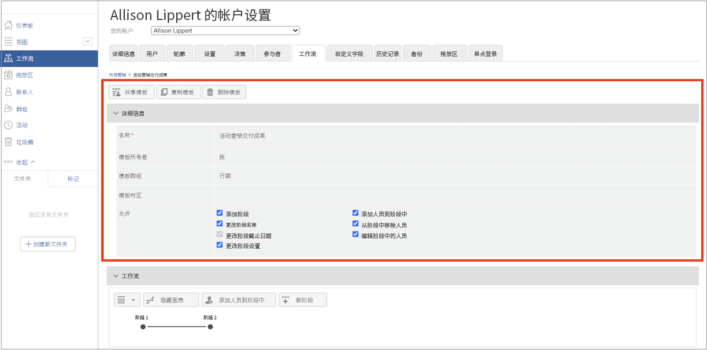
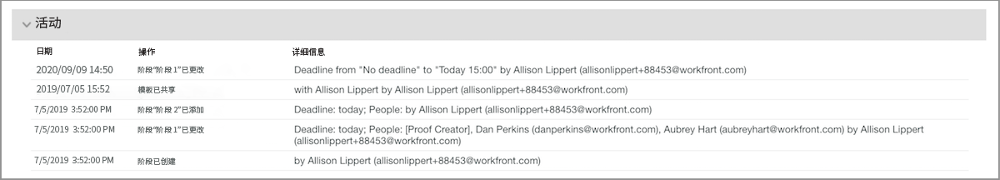

# 编辑自动化工作流模板

随着验证审核和审批流程的完善或组织发生变化，应更新自动化工作流模板，以反映使用 Workfront 的团队当前的操作情况。

保持模板处于最新状态可确保审核和审批流程的一致性，并节省上传验证的时间，因为他们不必不断调整工作流。

1. 从 [!DNL Workfront] 中的 **[!UICONTROL Main Menu]** 中选择 **[!UICONTROL Proofing]**。
1. 从那里选择左侧面板菜单中的 **[!UICONTROL Workflows]**。
1. 单击模板名称最右侧的三点菜单，然后选择 **[!UICONTROL View template details]**。

用于共享、复制和删除模板的选项位于每个模板的模板详细信息窗口的顶部。删除模板不会影响应用该模板的正在进行的验证，但这意味着该模板无法再使用。

<!--
Lean More URLs
-->

单击箭头以展开 [!UICONTROL Details] 部分，以便更改模板名称或模板时区等内容。

## 更改阶段和收件人

当精简流程后截止日期提前的情况下，或者当有人加入团队并会审查验证时，[!UICONTROL Workflow] 区域可能需要进行更改。

自动化工作流的每个阶段都有自己的部分，以便能够独立修改截止日期、隐私、验证收件人和其他信息。

本视频简要演示了您可以在 [!UICONTROL Workflow] 区域中进行的一些更改。请参阅此视频下的项目符号列表，其中列出了这些设置。该视频没有音频。

>[!VIDEO](https://video.tv.adobe.com/v/335131/?quality=12&learn=on)

作为回顾，以下是您可以在 [!UICONTROL Workflow] 部分中对验证模板进行的更改：

* 单击 [!UICONTROL stage name] 字段或 [!UICONTROL deadline] 字段以更新该信息。
* 选择 [!UICONTROL deadline] 旁边的箭头以锁定该阶段，确定何时激活该阶段，或者只需要一个决策。
* 在收件人列表中，单击 [!UICONTROL Role] 或 [!UICONTROL Email alerts] 字段以选择另一个选项。
* 转到收件人姓名最右侧的三点菜单，将其从列表中删除，将他们设为该工作流阶段的主要决策者，或编辑验证角色和电子邮件提醒信息。
* 您有两种选择可将收件人添加到列表中。打开 [!UICONTROL Add people to stage] 窗口后，单击要将其添加到哪个阶段。然后在收件人列表中输入他们的姓名或电子邮件地址，并分配验证角色和电子邮件提醒。完成后单击 [!UICONTROL Add people] 按钮。
   1. 在每个阶段部分的右上角，转到 [!UICONTROL More] 菜单并选择 [!UICONTROL Add people to stage]。
   1. 在 [!UICONTROL Workflow] 区域的顶部，选择 [!UICONTROL Add people to stage]。

## 模板共享

[!UICONTROL Shared With] 区域会显示可以使用该模板的验证用户。对于不再需要使用模板的人员，单击其姓名最右侧的三点菜单并选择 [!UICONTROL Remove] 对其进行删除。

![[!UICONTROL Shared With] 列表](assets/proof-system-setups-edit-template-shared-with.png)

但是，您无法从该部分将人员添加到共享列表。若要添加，请返回模板详细信息窗口的顶部，然后单击 [!UICONTROL Share template] 按钮。

## 活动部分

[!DNL Workfront] 会保存对模板进行更改的审核历史记录。您可以查看相关日期、谁进行的更改，以及有关所做更改的一些简要信息。

该部分不会记录有关验证何时使用模板的信息。

