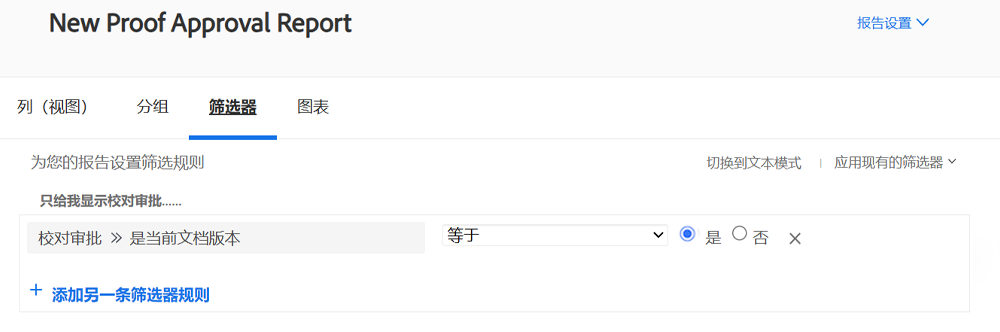
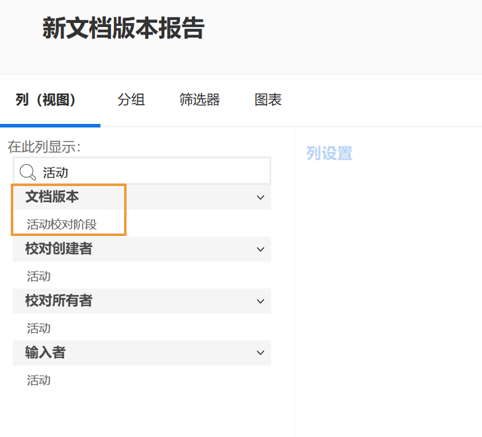
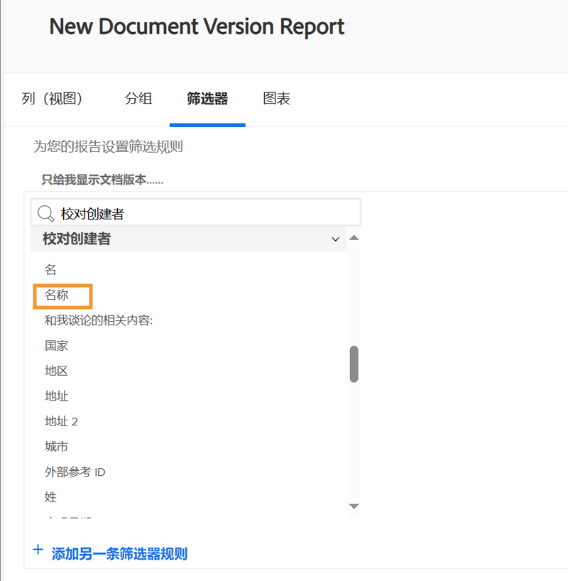

# 校样报告

[!DNL Workfront]的数字校对功能允许您在一个地方管理项目和相关审阅工作流 —  [!DNL Workfront]. 获得对使用显示审阅和批准信息的报告类型、字段源和字段名称完成的验证工作的宝贵洞察。

我们建议您与您的 [!DNL Workfront] 顾问创建满足您组织要求的报表。 部分报告需要熟悉 [!DNL Workfront]的文本模式报表。

从这些基本的标准报告开始，帮助您的团队管理在中经过审阅和批准流程的验证 [!DNL Workfront].

## [!UICONTROL Proof Approval]

此报表类型可帮助您跟踪未完成的验证审批，以确保满足截止日期。

![选择 [!UICONTROL Proof Approval] 从 [!UICONTROL New Report] 下拉菜单](assets/proof-system-setups-proof-approval-report.png)

查看和筛选选项包括 [!UICONTROL decision date]， [!UICONTROL proof approval]， [!UICONTROL approver stage]， [!UICONTROL workflow template]、和 [!UICONTROL requester information]. 使用文本模式报告，您可以创建一个按文档名称组织列表的分组。 参见 [了解分组的基本文本模式](https://experienceleague.adobe.com/docs/workfront-learn/tutorials-workfront/reporting/intermediate-reporting/basic-text-mode-for-groupings.html?lang=en).

在编写校样审批报告时，请确保您获得了与最新版本的校样相关的信息。 [!DNL Workfront] 建议在筛选器中包括此字段源和字段名称：

**[!UICONTROL Proof Approval]>>[!UICONTROL Is Current Document Version]**

当您报告具有多个版本的验证时，这将很有用，因此报告仅列出需要批准的每个验证的当前版本。 这会过滤掉您不再需要处理的早期版本。

## [!UICONTROL Document Version]

此报表类型允许您在中管理和跟踪版本 [!DNL Workfront].

![选择 [!UICONTROL Document Version] 从 [!UICONTROL New Report] 下拉菜单](assets/proof-system-setups-document-version-report.png)

查看选项包括来自以下项的信息： [!UICONTROL document version]， [!UICONTROL document]， [!UICONTROL entered by]， [!UICONTROL proof approval status]， [!UICONTROL proof creator]、和 [!UICONTROL document provider].

分组可由以下方式完成 [!UICONTROL document version]， [!UICONTROL entered by]， [!UICONTROL proof approval status]或验证所有者信息。

筛选器包括 [!UICONTROL document version]， [!UICONTROL access level]， [!UICONTROL document]， [!UICONTROL entered by]， [!UICONTROL proof approval status]， [!UICONTROL proof creator]和文档提供商信息。

您可以在报表中显示每个文档当前处于活动状态的验证阶段的名称，并在视图中显示此列：

**[!UICONTROL Document Versions]>>[!UICONTROL Active Proof Stages]**

如果当前没有处于活动状态的阶段，则该列为空。

此字段源>>字段名称也可用作报告中的过滤器。

使用 [!UICONTROL Proof Creator] 用于报告有关创建验证的用户信息的字段源。 选择 [!UICONTROL Name] 字段源，用于在视图中显示验证创建者的名称。

**[!UICONTROL Proof Creator]>>[!UICONTROL Name]**

此字段源>>字段名称组合也可用作过滤器。

<!--
Learn More Icon
Learn how to create reports in [!DNL Workfront] with the Report Creation class.
Access to proofing functionality
-->
