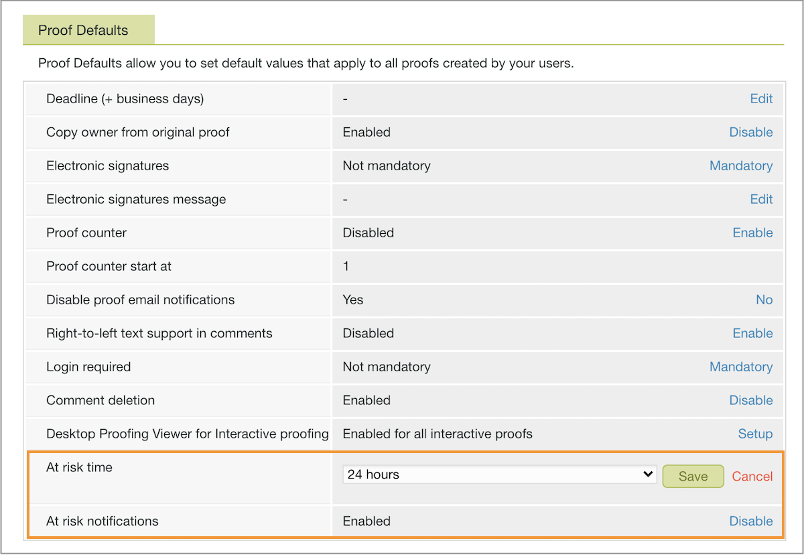

# 为存在风险的校样设置默认值

您需要为 [!DNL Workfront] 发送的存在风险通知进行设置。 这是关于校样期限即将到来的温馨提醒，其提醒对象是尚未作出决策的校样所有者和审批人。

默认情况下，有关存在风险的通知处于开启状态，校样期限在 24 个小时以内的校样会被视为“存在风险”。 [!DNL Workfront] 建议保持该通知（24 小时时间范围）处于开启状态。 但是，如果您组织的校样周转时间是几小时而不是几天，您可能需要将该时间范围缩短到几个小时。

1. 从 [!DNL Workfront’s] [!UICONTROL Main Menu] 中选择 **[!UICONTROL Proofing]**。
1. 在顶部导航栏中选择 **[!UICONTROL Account Settings]**。
1. 选择 **[!UICONTROL Settings]** 选项卡。
1. 转到 [!UICONTROL Proof Defaults] 部分。
1. 在 [!UICONTROL At risk time] 字段中，选择 **[!UICONTROL Setup]**。 然后选择应发送通知的校样期限之前的小时数。
1. 为该设置选择 **[!UICONTROL Save]**。
1. 确保在 [!UICONTROL At risk notifications] 字段中显示 [!UICONTROL Enabled]。 如果没有，请单击链接以开启该设置。

## 到您了

1. 登录 Workfront 并导航至“设置”区域。 在“审阅和审批”部分中，选择对指定校对收件人和非收件人的设置。
1. 现在使用 Workfront 中的主菜单转到校对设置（选择“校对”）。 对于所有校样和校样用户，将国家/地区、语言和时区设置为默认值。
1. 如果需要，请在校样设置区域的“设置”选项卡中调整“存在风险”通知时间。 与使用校样功能的团队沟通，确定最适合他们的选择。

<!--
Lean More URLs
-->
