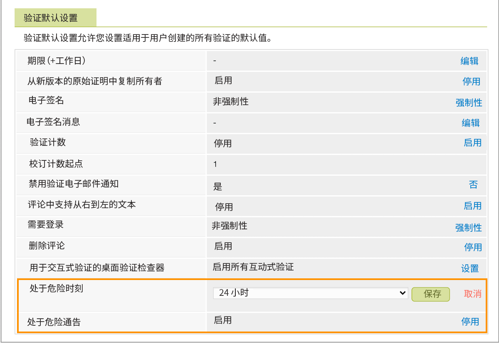

# 在风险验证设置中设置默认值

您将需要为风险通知建立设置 [!DNL Workfront] 发出。 这些内容温和地提醒了即将到来的验证截止日期，向尚未作出决定的验证所有者和批准者发送。

默认情况下，存在风险的通知处于开启状态，证明在证明截止时间前24小时被视为“存在风险”。 [!DNL Workfront] 建议在24小时的时间范围内开启此通知。 但是，如果贵组织的校样周转时间是数小时而不是数天，则您可能希望将此时间缩短到几小时。

1. 选择 **[!UICONTROL Proofing]** 从 [!DNL Workfront’s] [!UICONTROL Main Menu].
1. 选择 **[!UICONTROL Account Settings]** 中。
1. 选择 **[!UICONTROL Settings]** 选项卡。
1. 转到 [!UICONTROL Proof Defaults] 中。
1. 在 [!UICONTROL At risk time] 字段，选择 **[!UICONTROL Setup]**. 然后，选择在校样截止时间之前发送通知的小时数。
1. 选择 **[!UICONTROL Save]** 设置。
1. 确保上面写着 [!UICONTROL Enabled] 在 [!UICONTROL At risk notifications] 字段。 如果没有，请单击链接以打开设置。

## 该你了

1. 登录到Workfront，然后导航到“设置”区域。 在“审核和批准”部分，为指定的校样收件人和非收件人选择设置。
1. 现在，使用Workfront中的主菜单转到校样设置（选择校样）。 将国家/地区、语言和时区设置为所有校样和校样用户的默认值。
1. 如果需要，请在校样设置区域的“设置”选项卡中调整“处于风险”通知时间。 通过验证与团队进行交谈，以确定哪些项目最适合团队。

<!--
Lean More URLs
-->
