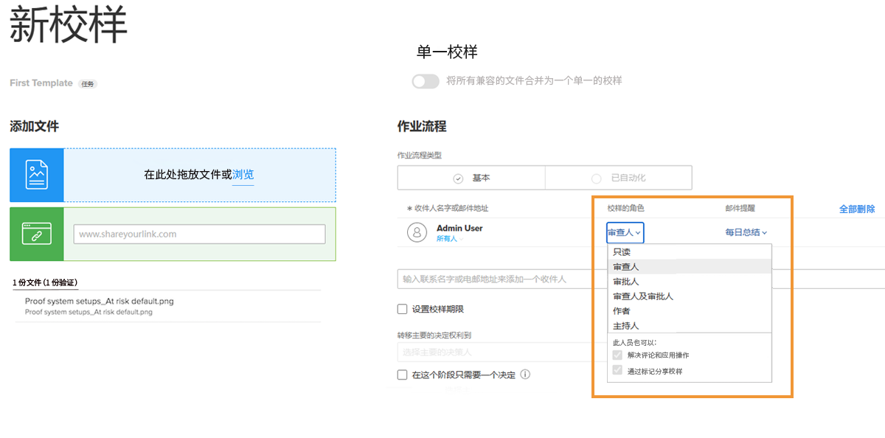
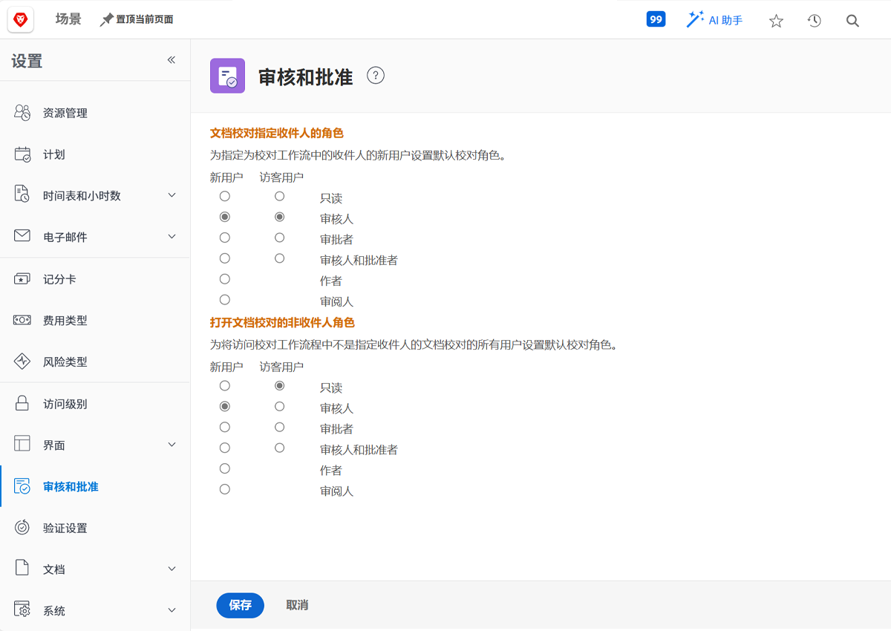

# 设置默认校对角色

<!---
21.4 updates have been made
--->

要完成的第一个默认设置是确定在创建新用户或人员打开验证时将分配的默认验证角色。

验证角色决定用户处理验证的能力 — 只需查看验证、发表评论、批准验证等。 [!DNL Workfront] 建议为所有用户设置验证角色默认值，以便更快、更轻松地向验证中添加收件人并设置工作流。

但是，此默认验证角色可以在上传单个验证时更改，确保每个人都能够履行在审阅和批准流程中要求的角色。

## 设置默认校对角色

1. 选择 **设置** 从 [!UICONTROL Main Menu].
1. 选择 **审阅和批准** 从左侧菜单中。
1. 单击两个新角色所需的默认验证角色旁边的按钮 [!DNL Workfront] “指定收件人”的用户和访客验证用户 — 手动或通过工作流模板添加到验证工作流中的任何人。
1. 单击两个新角色所需的默认验证角色旁边的按钮 [!DNL Workfront] “非收件人”用户的用户和访客验证用户。 这些规则通常是 [!DNL Workfront] 有权访问验证但未分配到工作流的用户。
1. 保存更改。

考虑当您的大多数用户和来宾添加到验证工作流时，他们应该做什么。 这应该是您的默认值。
