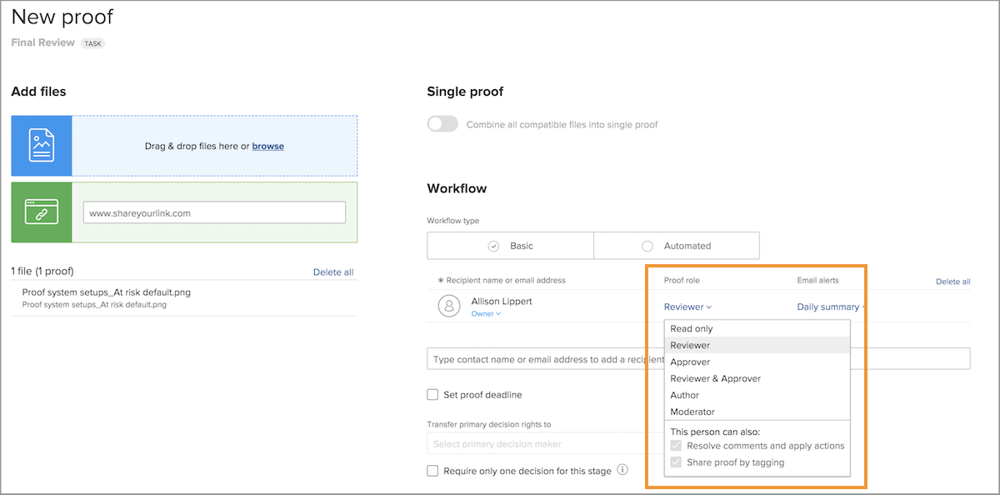
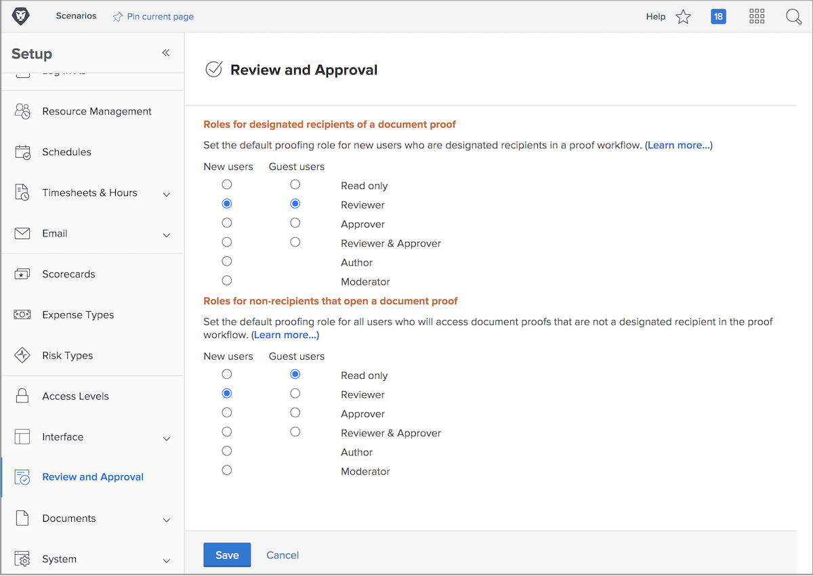

# 设置默认校样角色

要完成的第一个默认设置是确定在创建新用户或人们打开校样时将分配的默认校样角色。

验证角色可确定用户如何处理验证 — 只需查看验证、发表评论、批准验证等。[!DNL Workfront]建议为所有用户设置验证角色默认值，以便更快、更轻松地向验证添加收件人和设置工作流。

但是，这个默认的校对角色可以在上传单个校对时进行更改，以确保每个人都能够在审阅和审批过程中履行其所需的角色。

## 设置默认校样角色

1. 从 [!UICONTROL Main Menu] 中选择&#x200B;**设置**。
1. 从左侧菜单选择&#x200B;**审阅及审批**。
1. 单击新 [!DNL Workfront] 用户和“指定收件人”（手动或通过工作流模板添加到校样工作流的任何人）的访客校样用户所需的默认校样角色旁边的按钮。
1. 单击新 [!DNL Workfront] 用户和“非收件人”访客校样用户所需的默认校样角色旁边的按钮。 这些用户通常是有权访问校样的 [!DNL Workfront] 用户，但并未分配到工作流的人员。
1. 保存更改。

考虑一下，当您的大多数用户和访客被添加到校对工作流中时，他们应该做什么。 这应该是您的默认值。

## 最佳实践

| 最佳实践 | 原因如下 |
|---|---|
| 对于 Workfront 中的“打开文档校对的非收件人的角色”设置，仅使用“只读”或“审阅者”。 | 此设置的其他选项都需要作出校对决策，而这可能会破坏您的校对工作流。 通常情况下，未添加到校对工作流的人员只需要查看校对或发表评论，而不需要实际审批校对，因此“只读”或“审阅者”选项是您的最佳选择。   注释：此设置可在 Workfront 主菜单 > 设置 > 审阅及审批中找到。 |
