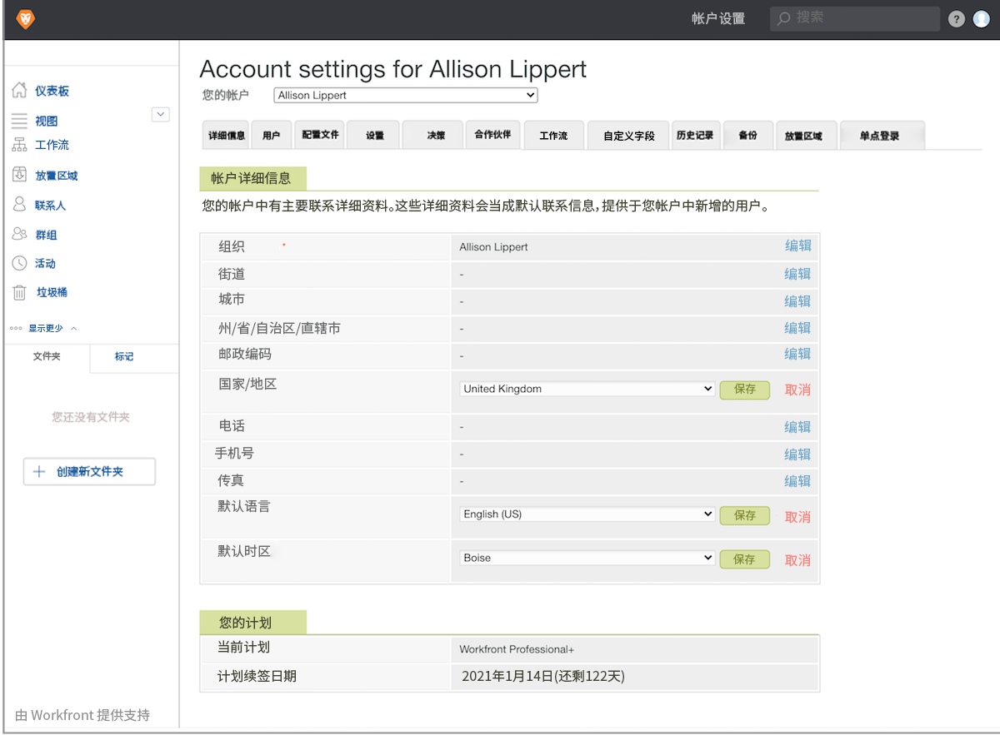

# 设置验证帐户默认设置

建立全局应用于所有验证和验证用户的默认帐户设置（国家/地区、语言和时区）。如果您的用户跨越多个时区或国家/地区，则可以根据需要在每个人的用户配置文件上调整这些设置。

1. 从 [!DNL Workfront's] [!UICONTROL Main Menu] 中选择 **[!UICONTROL Proofing]**。
1. 在顶部导航栏中选择 **[!UICONTROL Account Settings]**。
1. 选择 **[!UICONTROL Details]** 选项卡。
1. 前往 [!UICONTROL Country] 字段，并选择 **[!UICONTROL Edit]**。选择大多数验证用户所在的国家/地区作为默认国家/地区。
1. 为该设置选择 **[!UICONTROL Save]**。
1. 前往 [!UICONTROL Default language] 字段，并选择 **[!UICONTROL Edit]**。选择大多数验证用户将会使用的语言作为默认语言。
1. 为该设置选择 **[!UICONTROL Save]**。
1. 前往 [!UICONTROL Time zone default] 字段，并选择 **[!UICONTROL Edit]**。选择大多数验证用户所在的时区作为默认时区。这将是手动设置的验证工作流所识别的时区。它也适用于验证工作流模板，但每个模板都可以设置时区。
1. 为该设置选择 **[!UICONTROL Save]**。

## 最佳实践

| 最佳实践 | 原因如下 |
|---|---|
| 调整验证后端设置，以便用户看到 12 小时制格式的截止日期。 | 对于想要以 AM/PM 格式查看验证截止日期/时间的用户，请在验证设置中选择 F j, Y, gi:a 选项。对于使用 12 小时制的地区，这有助于明确截止日期。   注释：此设置可通过前往 Workfront 主菜单 > 验证 > 帐户设置 > 用户 > 并编辑每个用户的日期格式字段找到。 |
| 作为系统设置的一部分设立默认的验证期限。 | 设置默认验证截止日期后（上传日期 + x 个工作日），如果验证创建者忘记添加截止日期，则 Workfront 会自动将此截止日期应用于上传的每个验证。   注释：可通过前往 Workfront 主菜单 > 验证 > 帐户设置 > 设置 > 验证默认值 > 截止日期（+ 工作日）字段找到此设置。 |
| 隐藏不相关验证决策选项。 | 此决策选项通常会导致审批人感到困惑，因为组织通常不会定义何时应使用“不相关”选项。“不相关”选项通常表示该验证与验证收件人不相关，并且他们不需要作出审批或拒绝的决策。通过选择“不相关”，可以继续进行验证工作流。   大多数验证工作流中均不需要“不相关”选项。   注释：可通过转至 Workfront 主菜单 > 验证 > 帐户设置 > 决策来找到此设置。 |
| 请勿在验证设置中重新排序验证决策选项。 | 每个验证决策设置都有一个特定的值/权重，如果重新排序，这可能会混淆验证配置。决策顺序和值/权重可用作验证阶段激活触发器，并且也可以在报告中使用。   注释：可通过转至 Workfront 主菜单 > 验证 > 帐户设置 > 决策来找到此设置。 |
| 设置验证角色和电子邮件提醒的用户默认值。 | 分配验证工作流时，这些设置会自动填充，从而加快流程，并有助于保持整个验证工作流中的一致性。   注释：通过转至 Workfront 主菜单 > 验证 > 帐户设置 > 用户 > 并选择要设置默认值的用户，可以找到用户默认设置。 |
