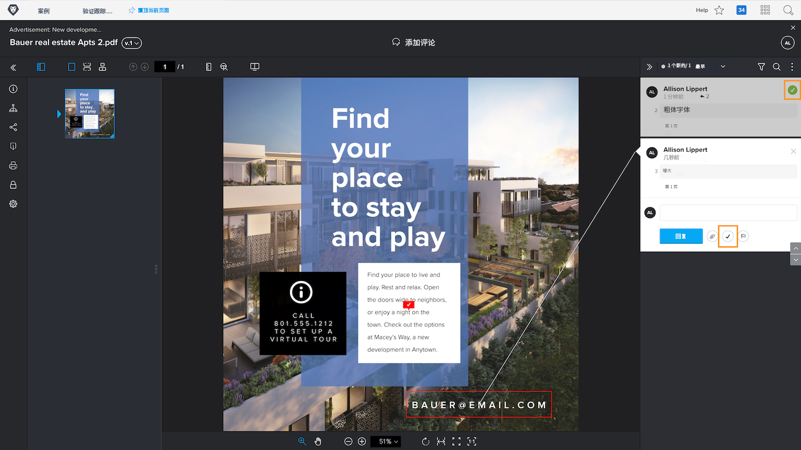

# 管理校对评论

[!DNL Workfront] 通过注释操作或解决注释，帮助您跟踪和管理与验证中每个注释相关的工作（例如对资产进行更正）。

验证操作是评论上的“标记”或“标签”，通常用于指示对评论已采取或需要采取的操作。 可以从图标或每个评论上的更多菜单中选择操作。

例如，您负责确定在审阅过程中所做的哪些更正应实际执行。 使用操作，您可以标记相关注释，让设计人员或编辑人员知道要进行哪些修订。 然后，该人员可以使用其他操作来指示所做的更改。

![具有的验证查看者中的验证图像 [!UICONTROL To Do] 评论中突出显示的验证操作。](assets/manage-comments-2.png)

如果评论中未列出操作，则表示贵组织尚未设置这些操作。 如果您认为操作是您的组织应使用的操作，请与验证系统管理员联系。

“解决注释”特征通常用于指示注释已以某种方式得到处理 — 已进行更正或问题已得到回答。 部分 [!DNL Workfront] 当评论是不需要进行的更正或只是已阅读的评论时，客户“解决”该评论。

单击复选标记图标可解析注释。 这会在注释上放置一个绿色复选标记，这样可以轻松地识别在浏览注释列时已审阅哪些注释。

您可以通过这两项功能来过滤“注释”列，从而帮助您管理在使用验证时看到的内容。

![验证查看器中带有的注释过滤器的图像 [!UICONTROL Actions] 和 [!UICONTROL General] 筛选选项突出显示。](assets/manage-comments-3.png)

## 轮到你了

>[!IMPORTANT]
>
>别忘了提醒任何分配到验证工作流的同事，您正在将使用验证作为您的Workfront培训的一部分。

1. 查找您已在Workfront中上传的证据。 打开验证查看器以查看已作出的评论并回复评论。 完成后，关闭校样查看器。
1. 使用“更新”部分（在“文档详细信息”或“摘要”面板中）查看您已上传到Workfront的验证的最新评论。 回复评论。

<!--
## Learn more
* Create and manage proof comments
-->
