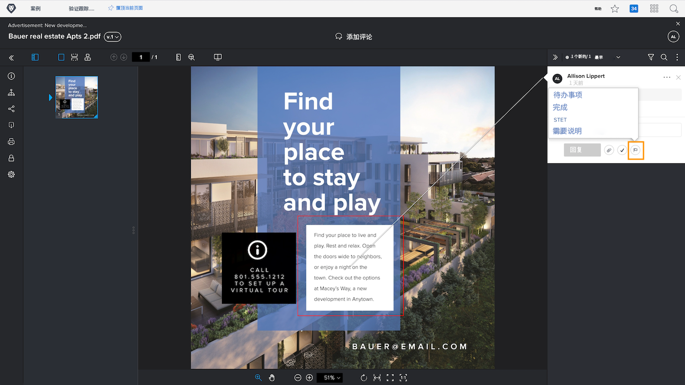

# 管理验证评论

[!DNL Workfront] 可以帮助您通过评论操作或解决评论来跟踪和管理与验证上的每条评论相关的工作，例如对资源进行更正。

验证操作是评论上的“标志”或“标签”，通常用于指示已针对评论采取或需要采取的操作。可以从每个评论的图标或“更多”菜单中选择操作。

例如，您负责决定实际上应该执行审核过程中所做的哪些更正。使用操作功能，您可以标记相关评论，让设计者或编辑知道要进行哪些修改。然后，该人可以使用另一个操作来表明已进行更改。

![验证查看器中的验证图像，其中评论上突出显示了 [!UICONTROL To Do] 验证操作。](assets/manage-comments-2.png)

如果您没有看到评论中列出的操作，则表明您的组织尚未设置这些操作。如果您认为您的组织应该使用操作，请与您的验证系统管理员联系。

“解决评论”功能通常用于指示评论已以某种方式得到解决 - 已进行更正或问题已得到解答。当评论是不需要进行更正或只是已阅读的评论时，一些 [!DNL Workfront] 客户会“解决”该评论。

单击复选标记图标即可解决评论。这会在评论上放置一个绿色复选标记，这样您在浏览评论栏时就可以轻松识别哪些评论已审核。

您可以通过这两个功能过滤评论列，帮助您整理在处理验证时看到的内容。

![验证查看器中评论过滤器的图像，其中突出显示 [!UICONTROL Actions] 和 [!UICONTROL General] 过滤选项。](assets/manage-comments-3.png)

## 到您了

>[!IMPORTANT]
>
>不要忘记提醒分配给验证工作流的任何同事，您正在使用验证作为 Workfront 培训的一部分。

1. 查找您已在 Workfront 中上传的验证。打开验证查看器查看已发表的评论并回复评论。完成后关闭验证查看器。
1. 使用文档详细信息或摘要面板中的“更新”部分查看您在 Workfront 中上传的验证的最新评论。回复评论。

<!--
## Learn more
* Create and manage proof comments
-->
