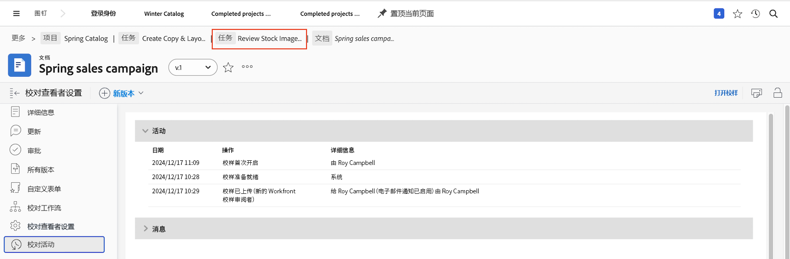

# 了解校样详细信息

## 查看校样详细信息

作为校样管理者或所有者，您可以通过摘要面板和 [!UICONTROL Document Details] 页面。 首先，在 [!UICONTROL Documents] 项目、任务或问题的部分。

### “摘要”面板

摘要面板提供了校样基本详细信息的高级概述。 需要时可使用图标展开面板，不需要时可折叠面板。您甚至可以将鼠标悬停在校样的缩略图上以打开或下载它。

![图像 [!UICONTROL Documents] 部分，并展开“摘要”面板。 摘要面板图标和摘要面板均高亮显示。](assets/document-summary.png)

注意：的 [!UICONTROL Approvals] 摘要面板中的部分适用于 **文档** 批准和 **不是** 与您在本课程中了解的验证审核和批准流程相关。 这两个过程在 [!DNL Workfront].

### [!UICONTROL Document Details]

如果您需要更多关于校样的信息， [!UICONTROL Document Details] 链接会将您转到 [!DNL Workfront].

![中校样页面的图像 [!DNL  Workfront].](assets/document-details.png)

请务必注意，能否查看与校对过程相关的信息取决于您在 [!DNL Workfront].

在校样的页面中，您可以从左侧面板菜单访问以下部分：

* **更新 —** 在校样查看器中发表的评论显示在此处，并带有“校样评论”标记。 您还可以对文件进行注释，就像对任务或项目进行注释一样（这些注释不会显示在校样查看器中）。
* **批准 —** 此部分用于文档批准，而不是校对批准。 在中，两种类型的批准是不同的流程 [!DNL Workfront] 不要链接在一起。 如果您使用校样工作流进行审阅和批准，则不会使用此部分。
* **所有版本 —** 跟踪和管理校样的版本历史记录。 在的“摘要”面板中，您可能会发现 [!UICONTROL Documents] 列表。
* **自定义Forms —** 自定义表单用于校样以捕获特定于组织的信息。 此信息可随文件一起传递到集成的文档存储系统，例如 [!DNL Workfront] DAM或 [!DNL Adobe’s] AEM。 自定义表单由 [!DNL Workfront] 系统管理员或组管理员。 与团队或管理员联系，了解您是否将在校样中使用自定义表单。
* **校对工作流 —** 管理或修改分配给校样的工作流。 您可以使用 [!UICONTROL Proofing Workflow] 链接 [!UICONTROL Documents] 列表。 通过编辑校样工作流视频了解如何对工作流进行更改。

让我们更仔细地查看以下两个部分： [!UICONTROL Proofing Viewer Settings] 和 [!UICONTROL Proofing Activity].

### [!UICONTROL Proofing Viewer Settings]

这些设置可帮助您控制对校样本本身的访问。

![图像 [!UICONTROL Proofing Viewer Settings] 从校样的页面 [!UICONTROL Proofing Viewer Settings] 选项。](assets/proofing-settings-on-details-page.png)

* **[!UICONTROL Require login. This proof cannot be shared with guest users]—** 只能与具有 [!DNL Workfront] 校对许可证。
* **[!UICONTROL Require decisions to be electronically signed]—** 共享校样时，这要求收件人具有 [!DNL Workfront] 并在做出校样决定时，通过输入校样密码，使校样“以电子方式签名”。 (注：校对密码与 [!DNL Workfront] 密码。 校样密码不容易访问，因此大多数收件人都不知道此密码。) [!DNL Workfront] 建议与 [!DNL Workfront] 顾问。
* **[!UICONTROL Lock proof when all required decisions are made ]—** 一旦对证据做出每项决定，这就会将证据锁定到任何进一步的评论、回复、决定等。 这会锁定整个校样版本，而不只是校样工作流的特定阶段。
* **[!UICONTROL Allow downloading the original file]—** 校样收件人可以从校样查看器下载校样的原始源文件（右侧面板菜单中提供了选项）。
* **[!UICONTROL Allow sharing proof via public URL or embed code]—** 校样收件人可以与任何人共享一个可公开访问的校样链接。
* **[!UICONTROL Allow subscribing to proof via public URL or embed code]—** 向公共URL发送的任何人都可以使用其电子邮件地址和名称（如果不是校样用户）或其电子邮件地址和校样密码（如果是校样用户）将自己添加到校样中。 (注：校对密码与 [!DNL Workfront] 密码。)

在 [!UICONTROL Proof settings] 部分。

![图像 [!UICONTROL Proof settings] 部分。](assets/proof-settings-on-upload-page.png)

### [!UICONTROL Proofing Activity]

本页跟踪校样中发生的所有活动，以及与此校样相关而发送的电子邮件。

![图像 [!UICONTROL Proofing Activity] 校样页面的部分 [!UICONTROL Proofing Activity] 选项。](assets/proofing-activity-in-details.png)

的 [!UICONTROL Activity] 部分时间戳，以及评论和决策的发布者。 它还跟踪校样工作流阶段何时开始、收件人首次打开校样时，以及校样管理器或所有者希望了解的其他信息。 当您尝试了解以下事项时，这些详细信息会非常有用，例如，校对工作流阶段为何从未启动。

的 [!UICONTROL Messages] 部分电子邮件警报和消息发送给收件人、发送者以及消息内容的时间戳。 如果有人说他们没有收到有关校样的电子邮件，则在进行故障诊断时，这非常有用。 您可以检查是否以及何时发送了电子邮件。

[!DNL Workfront] 建议校样管理器和校样所有者熟悉这两个部分中的信息。 当您将这些信息与了解如何阅读 [!UICONTROL SOCD] 进度栏中，无论校样位于校样工作流的什么位置，您都可以真正了解和管理校样。

完成在 [!UICONTROL Document Details] 部分，使用痕迹导航跟踪返回到 [!UICONTROL Documents] 项目、任务或发出校样的部分。

<!--
#### Learn more
* [!UICONTROL Document details] overview
* Add a custom form to a document
* Request document approvals
* Summary for documents overview
* View activity on a proof within [!DNL Workfront]
-->
