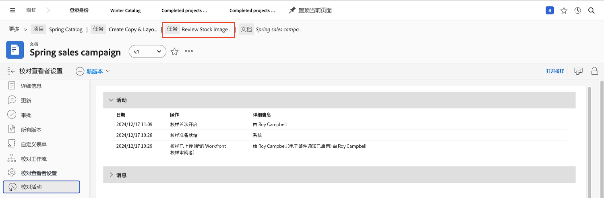

# 了解校样细节

## 查看校样细节

作为校样管理者或所有者，您可以通过摘要面板和 [!UICONTROL Document Details] 页面深入了解校样背后的细节。 首先在项目、任务或问题的 [!UICONTROL Documents] 部分找到您的校样。

### 摘要面板

从文档列表中选择一个校样，然后单击屏幕右上角的“摘要”图标。

![项目 [!UICONTROL Documents] 部分的图像，其中已选择校样。](assets/document-summary-1.png)

接下来单击“概述”以展开概述部分。

![项目 [!UICONTROL Documents] 部分的图像，其中已选择校样并已展开摘要面板。 摘要面板图标和摘要面板均突出显示。](assets/document-summary-2.png)

然后向下滚动到校对部分。 在这里您可以看到校样所有者、进度、评论数量、状态和截止日期。

![项目 [!UICONTROL Documents] 部分的图像，其中已选择校样并已展开摘要面板。 摘要面板图标和摘要面板均突出显示。](assets/document-summary-3.png)

注释：摘要面板中的 [!UICONTROL Approvals] 部分用于&#x200B;**文档**&#x200B;审批，**与校对审阅和审批流程无关**。 这两个流程在 [!DNL Workfront] 中是分开的。

### [!UICONTROL Document Details]

要获取有关校样的更多信息，请单击 [!UICONTROL Document Details]。

![项目 [!UICONTROL Documents] 部分的图像，其中已选择校样并突出显示 [!UICONTROL Document Details]。](assets/document-summary-4.png)

这将带您进入 [!UICONTROL Document Details] 页面，左侧面板中将显示各种附加选项。

![[!DNL  Workfront] 中校样页面的图像。](assets/document-details.png)

需要注意的是，能否查看与校对过程相关的信息取决于您在 [!DNL Workfront] 中的校对权限。

在校样页面中，您可以从左侧面板菜单访问这些部分：

* **更新——**&#x200B;在校样查看器中所做的评论会在此处显示，并带有“校样评论”标记。 您还可以对文件发表评论，就像对任务或项目发表评论一样（这些评论不会出现在校样查看器中）。
* **审批——**&#x200B;此部分用于文件审批，而不是校对审批。 这两种类型的审批在 [!DNL Workfront] 中是单独的流程，它们之间没有关联。 如果您使用校对工作流进行审阅和审批，则不会用到此部分。
* **所有版本——**&#x200B;跟踪和管理校样的版本历史记录。 您可能会发现在 [!UICONTROL Documents] 列表的摘要面板中更容易访问这些信息。
* **自定义表单——**&#x200B;自定义表单用于校样，以捕获特定于组织的信息。 该信息可以与文件一起传递到集成文档存储系统，例如 [!DNL Workfront] DAM 或 Adobe Experience Manager。 自定义表单由您的 [!DNL Workfront] 系统管理员或组管理员设置。 请与您的团队或管理员沟通，了解您是否会在校样上使用自定义表单。
* **校对工作流——**&#x200B;管理或修改分配给校对的工作流。 您也可以使用 [!UICONTROL Documents] 列表中校样上的 [!UICONTROL Proofing Workflow] 链接打开此窗口。

让我们仔细看看其中的两个部分：[!UICONTROL Proofing Viewer Settings] 和 [!UICONTROL Proofing Activity]。

### [!UICONTROL Proofing Viewer Settings]

这些设置可以帮助您控制对校样本身的访问。

![校样页面中 [!UICONTROL Proofing Viewer Settings] 的图像，其中左侧面板菜单中突出显示 [!UICONTROL Proofing Viewer Settings] 选项。](assets/proofing-settings-on-details-page.png)

* **[!UICONTROL Require login. This proof cannot be shared with guest users]——**&#x200B;该校对只能与拥有 [!DNL Workfront] 校对许可的人共享。
* **[!UICONTROL Require decisions to be electronically signed]——**&#x200B;共享校对时，要求收件人在 [!DNL Workfront] 中具有校对权限，并在作出校对决策时通过输入校对密码对校对进行“电子签名”。 （注：校对密码与您的 [!DNL Workfront] 密码不同。 验证密码不易访问，因此大多数收件人不会知道此密码。) Adobe建议在使用此功能之前与您的[!DNL Workfront]顾问交谈。
* **[!UICONTROL Lock proof when all required decisions are made]——**&#x200B;在对校样作出每个决策后，这会对其进行锁定，无法再进一步地评论、回复、作出决策等。 这会锁定整个校对版本，而不仅仅是校对工作流中的特定阶段。
* **[!UICONTROL Allow downloading the original file]——** 校对接收者能够从校对查看器下载校对的原始源文件。
* **[!UICONTROL Allow sharing proof via public URL or embed code]——**&#x200B;校样收件人可以与任何人共享可公开访问的校样链接。
* **[!UICONTROL Allow subscribing to proof via public URL or embed code]——**&#x200B;收到公共 URL 的任何人都可以使用其电子邮件地址和姓名（如果不是校对用户）或其电子邮件地址和校对密码（如果是校对用户）将自己添加到校对中。 （注释：校对密码与 [!DNL Workfront] 密码不同。）

### [!UICONTROL Proofing Activity]

此页面会跟踪校样上出现的所有活动，以及所发送的有关此校样的电子邮件信息。

![校样页面中 [!UICONTROL Proofing Activity] 部分的图像，其中左侧面板菜单中突出显示 [!UICONTROL Proofing Activity] 选项。](assets/proofing-activity-in-details.png)

**[!UICONTROL Activity]** 部分标记了发表评论和作出决策的时间，以及发表评论和作出决策的人。 它还会跟踪校对工作流阶段何时开始、收件人何时首次打开校对，以及校对管理者或所有者想要了解的其他信息。 例如，当您希望弄清楚为什么校对工作流阶段从未启动等问题时，这些详细信息可能会很有帮助。

**[!UICONTROL Messages]** 部分标记了向收件人发送电子邮件提醒和消息的时间、发送者以及消息的内容。 如果有人说他们没有收到有关校样的电子邮件，这在对此进行故障排除时会很有用。 您可以检查电子邮件是否以及何时发送。

Adobe 建议校样管理者和所有者熟悉这两个部分中的信息。 当您将这些信息与有关理解如何阅读 [!UICONTROL SOCD] 进度条的信息相结合时，无论校对在校对工作流中处于何处，您都可以真正地理解和管理您的校对。

在完成 [!UICONTROL Document Details] 部分后，使用痕迹导航路径返回附有该校样的项目、任务或问题的 [!UICONTROL Documents] 部分。

<!--
#### Learn more
* [!UICONTROL Document details] overview
* Add a custom form to a document
* Request document approvals
* Summary for documents overview
* View activity on a proof within [!DNL Workfront]
-->
