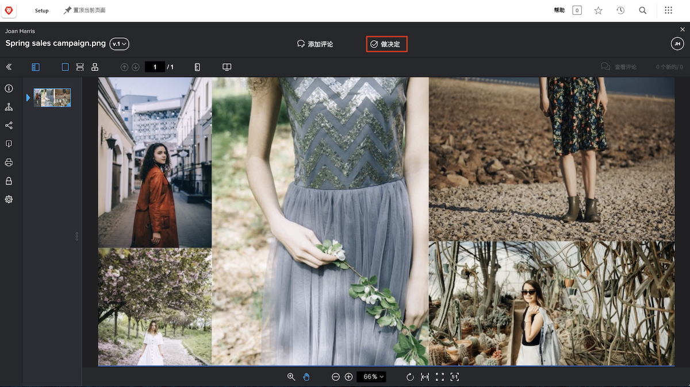

# 审阅并审批校对

在开始审阅校对之前，请确保您知道对您的期望是什么。您在校对工作流中扮演什么角色？审阅校对、审批它，还是两者兼而有之？

作为文字编辑，您的工作重点可能是检查语法错误和拼写错误。营销和创意团队可能会专注于资源的设计并确保遵循企业品牌的要求。法律团队可能会确保服务合同的措辞无懈可击。项目经理可能会确保正在审阅的内容符合与其相关的项目的意图和目标。

您可能还会被要求审批该校样。审批校样意味着您说：“这项工作没问题，已经准备就绪。”或者您可能要说：“这项工作需要修改，请发回修改。”

在您知道预期的内容后，就可以开始审阅校对了。

## 收到审阅的校对

当资源准备好接受审阅和审批时，您将会收到电子邮件通知。

![一封要求对 [!DNL  Workfront] 中的两份校对进行审阅和审批的新校对电子邮件的图像。](assets/new-proof-emails.png)

请务必注意，此校样链接对于您来说是独一无二的。如果您与某人分享该链接，他们所做的任何评论和标记都将标有您的名字。

该 [!UICONTROL New Proof] 电子邮件还包含有关该校样的基本信息：

* 校样的名称是电子邮件的主题行。
* 使用缩略图可让您快速浏览要审阅的内容。
* 版本号会显示您查看的是哪个版本的校样。
* 而且，最重要的是，截止日期会出现在电子邮件中的两个位置——校样详细信息部分的正上方和您所在工作流阶段的灰色栏中。

准备好开始审阅后，您所要做的就是单击蓝色的 [!UICONTROL Go to proof] 按钮，然后文件会自动在 [!DNL Workfront] 校对查看器中打开。

### 从 [!UICONTROL Home] 中打开校样

如果您使用 [!DNL Workfront]，并被要求审批校样，您会在 [!DNL Workfront] [!UICONTROL Home] 的 [!UICONTROL My Approvals] 中找到一项任务。

![[!UICONTROL My Approvals] 小组件的图像，位于 [!DNL Workfront] [!UICONTROL Home]。](assets/open-proof-from-home.png)

值得注意的是，只有当分配您审批校样时，它才会显示在 [!DNL Workfront][!UICONTROL Home] 中。如果您只是被要求审批校对，它不会显示在 [!DNL Workfront] [!UICONTROL Home]。

单击 [!UICONTROL Go to Proof] 链接，将其在校对查看器中打开。

根据您组织的校样和项目工作流，您可能会在 [!DNL Workfront] [!UICONTROL Home] 中看到任务分配，而不是校样审批请求。在这种情况下，您会从任务本身的 [!UICONTROL Documents] 部分打开校样（请参阅下面的说明）。

您还可以在专门为您的团队或组织创建的用于帮助管理校订工作流的 [!DNL Workfront] 仪表板上找到要审阅的校样。

### 打开项目、任务或问题的校样

如果您通常在 [!DNL Workfront] 中处理项目、任务或问题，您可能更喜欢直接从该项目的 [!DNL Documents] 部分打开校样。

![突出显示了 [!UICONTROL Open Proof] 链接的 [!DNL  Workfront] 任务中的 [!UICONTROL Documents] 部分的图像。](assets/open-proof-from-documents.png)

1. 单击项目、任务或问题的名称。
2. 单击项目页面的左侧面板菜单中的 [!UICONTROL Documents]。
3. 在 [!UICONTROL Documents] 列表中找到该校样。
4. 单击 [!UICONTROL Open Proof] 链接，打开校对查看器。

## 如何审批校样

打开校样后，您将在顶部的&#x200B;**添加评论**&#x200B;旁边看到&#x200B;**作出决策**&#x200B;按钮。如果您不是此校样的审批人，则您不会看到此按钮。

当您准备好作出决策时，请单击&#x200B;**作出决策**&#x200B;按钮，以查看您的决策选项。进行选择，然后单击下面的另一个&#x200B;**作出决策**&#x200B;按钮。

## 审阅并审批校对

在本视频中，您将学习如何：

* 了解审阅校样时对您的期望
* 对校样发表评论
* 使用标记来指示校样所需的更改
* 回复校样评论
* 审批或拒绝校样

>[!VIDEO](https://video.tv.adobe.com/v/335141/?quality=12&learn=on&enablevpops=1)

<!--
#### Learn more
* Create and manage proof comments
* Make decisions on a proof
* Review a static proof
* Tag users to share a proof
* Notifications for proof comments and decisions
-->

<!--
#### Guides
* Reviewing proofs in [!DNL Workfront]
* -->
