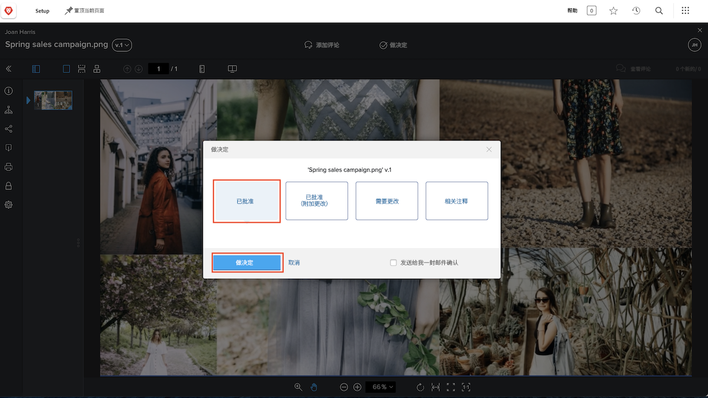

# 审查并审批验证

在开始审查验证之前，请确保您知道对您的期望是什么。您在验证工作流中扮演什么角色？审查验证、审批它，还是两者兼而有之？

作为文字编辑，您的工作重点可能是检查语法错误和拼写错误。营销和创意团队可能会专注于资源的设计并确保遵循企业品牌的要求。法律团队可能会确保服务合同的措辞无懈可击。项目经理可能会确保正在审查的内容符合与其相关的项目的意图和目标。

您可能还会被要求审批该验证。审批验证意味着您说：“这项工作没问题，已经准备就绪。”或者您可能要说：“这项工作需要修改，请发回修改。”

在您知道预期的内容后，就可以开始审查验证了。

## 收到审查的验证

当资源准备好接受审查和审批时，您将会收到电子邮件通知。

![一封要求对 [!DNL  Workfront] 中的两份验证进行审查和审批的新验证电子邮件的图像。](assets/new-proof-emails.png)

请务必注意，此验证链接对于您来说是独一无二的。如果您与某人分享该链接，他们所做的任何评论和标记都将标有您的名字。

该 [!UICONTROL New Proof] 电子邮件还包含有关该验证的基本信息：

* 验证的名称是电子邮件的主题行。
* 使用缩略图可让您快速浏览要审查的内容。
* 版本号会显示您查看的是哪个版本的验证。
* 而且，最重要的是，截止日期会出现在电子邮件中的两个位置——验证详细信息部分的正上方和您所在工作流阶段的灰色栏中。

准备好开始审查后，您所要做的就是单击蓝色的 [!UICONTROL Go to proof] 按钮，然后文件会自动在 [!DNL Workfront] 验证查看器中打开。

### 从 [!UICONTROL Home] 中打开验证

如果您在使用 [!DNL Workfront]，并被要求审批验证，您会在 [!DNL Workfront] [!UICONTROL Home] 的 [!UICONTROL Work List] 中找到一项任务。建议您只从 [!UICONTROL Filter] 中选择 [!UICONTROL Approvals]，这样您就可以专注于这类工作。

![[!DNL Workfront] [!UICONTROL Home] 的图像，其中激活了 [!UICONTROL Approvals] 过滤器，并从列表中选择了验证。](assets/open-proof-from-home.png)

值得注意的是，只有当分配您审批验证时，它才会显示在 [!DNL Workfront][!UICONTROL Home] 中。如果您刚刚被要求只审查该验证，则当您从过滤器列表中选择 [!UICONTROL Approvals] 时，它不会显示在 [!DNL Workfront] [!UICONTROL Home] 中。

在 [!UICONTROL Work List] 中选择验证审批，然后单击 [!UICONTROL Go to Proof] 链接以在验证查看器中打开它。

根据您组织的验证和项目工作流，您可能会在 [!DNL Workfront] [!UICONTROL Home] 中看到任务分配，而不是验证审批请求。在这种情况下，您会从任务本身的 [!UICONTROL Documents] 部分打开验证（请参阅下面的说明）。

您还可以在专门为您的团队或组织创建的用于帮助管理验证工作流的 [!DNL Workfront] 仪表板上找到要查看的验证。

### 打开项目、任务或问题的验证

如果您通常在 [!DNL Workfront] 中处理项目、任务或问题，您可能更喜欢直接从该项目的 [!DNL Documents] 部分打开验证。

![突出显示了 [!UICONTROL Open Proof] 链接的 [!DNL  Workfront] 任务中的 [!UICONTROL Documents] 部分的图像。](assets/open-proof-from-documents.png)

1. 单击项目、任务或问题的名称。
2. 单击项目页面的左侧面板菜单中的 [!UICONTROL Documents]。
3. 在 [!UICONTROL Documents] 列表中找到该验证。
4. 单击 [!UICONTROL Open Proof] 链接，打开验证查看器。

## 如何审批验证

打开验证后，您将在顶部的&#x200B;**添加评论**&#x200B;旁边看到&#x200B;**作出决策**&#x200B;按钮。如果您不是此验证的审批人，则您不会看到此按钮。

当您准备好作出决策时，请单击&#x200B;**作出决策**&#x200B;按钮，以查看您的决策选项。进行选择，然后单击下面的另一个&#x200B;**作出决策**&#x200B;按钮。

## 审查并审批验证

在本视频中，您将学习如何：

* 了解审阅验证时对您的期望
* 对验证发表评论
* 使用标记来指示验证所需的更改
* 回复验证评论
* 审批或拒绝验证

>[!VIDEO](https://video.tv.adobe.com/v/335141/?quality=12&learn=on&enablevpops)

<!--
#### Learn more
* Create and manage proof comments
* Make decisions on a proof
* Review a static proof
* Tag users to share a proof
* Notifications for proof comments and decisions
-->

<!--
#### Guides
* Reviewing proofs in [!DNL Workfront]
* -->
