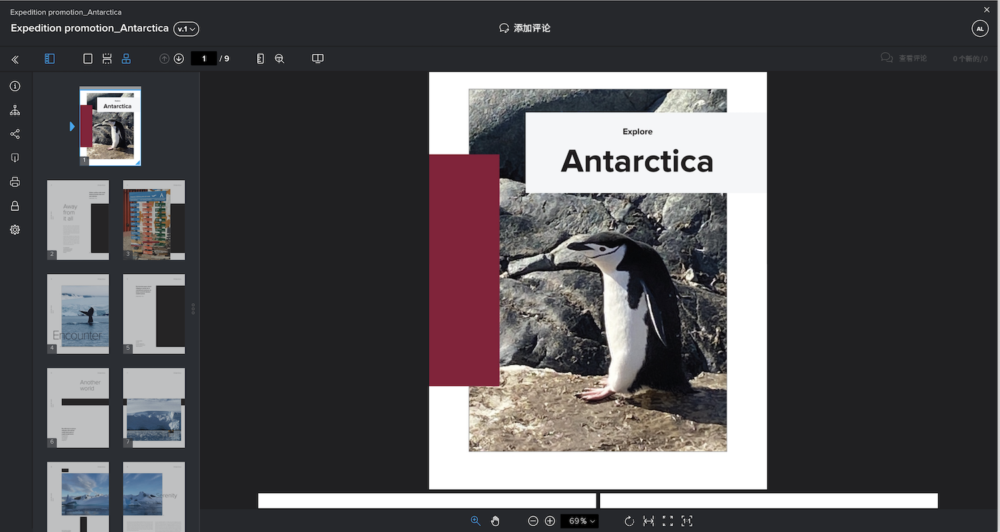
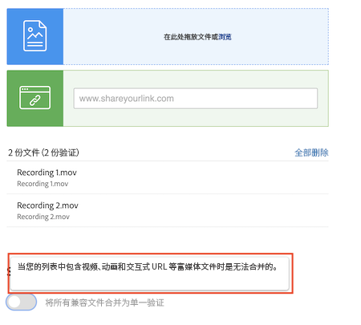

# 将多个文件合并为一份验证

将多个文件组合成一个验证通常可以使验证过程更加简化。

当各个文件相关联或属于整体可交付结果的一部分，并且所有文件都需要由同一个人在同一截止日期前审核时，“合并”选项非常有用。

例如，创意团队设计了一本小册子。四位设计师制作了这些页面，并将其保存为单独的 PDF。如果每个设计师将这些作为单独的验证上传，则审核人将会有四个单独的验证需要审阅。此外，确保小册子的各个部分能够拼凑在一起会更加困难。

解决方案——让一个人上传所有 PDF，并在上传时将它们合并为一份验证。这使得审核人可以将小册子看作一个整体，而不是分开的部分。

若要合并验证：

1. 打开附加该验证的项目、任务或问题的 [!UICONTROL Documents] 部分。
1. 单击&#x200B;**新增>验证**。
1. 将文件拖放到上传区域，或浏览到这些文件。[!DNL Workfront] 最多支持合并 50 个文件。
1. 在&#x200B;**单个校对**&#x200B;下，切换将所有兼容的文件合并到一个校对的选项。
1. 为合并的验证输入一个名称。这是必填项。
1. 如果需要，您可以通过在上传列表中拖放来更改文件的合并顺序。
1. 添加验证收件人、设置截止日期等。
1. 单击 [!UICONTROL Create Proof] 以完成上传。

![[!UICONTROL New proof] 窗口的图像，其中突出显示上传的文件列表和 [!UICONTROL Single proof] 部分。](assets/combine-proofs.png)

上传验证后，您将在 [!UICONTROL Documents] 选项卡中看到它的 ZIP 文件。

查看合并的文件不需要任何其他操作。只需像往常一样单击 [!UICONTROL Open Proof]，验证便会在验证查看器中打开。

## 可以合并视频文件吗？

抱歉，当您的列表中包含视频、动画和交互式 URL 等富媒体文件时，无法合并文件。

## 到您了

>[!IMPORTANT]
>
>请不要忘记提醒您的同事，您向他们发送的验证是您 Workfront 培训的一部分。

在您的计算机上查找三个或四个文件(PDF、文本文件等)。

1. 打开您要在 Workfront 中进行实践练习的项目、任务或问题。
1. 上传这些文件，将它们组合成一个验证。
1. 通过将列表中的最后一个文件移动到列表中的第一个位置来调整文件的顺序。
1. 分配您选择的工作流（基本或自动）并完成上传。

<!--
##Learn more
* Create a multi-page proof
-->
