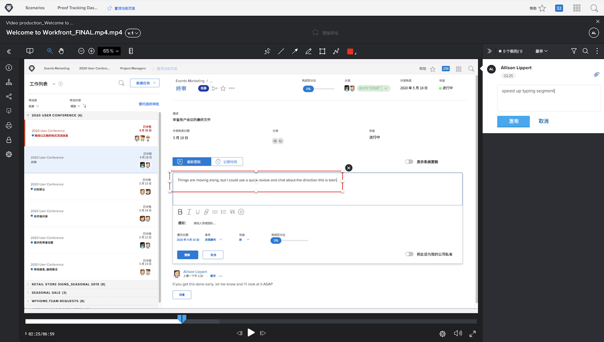

# 上传视频校样

[!DNL Workfront’s] 校对功能不仅仅适用于 PDF、电子表格或图像等静态文件。 [!DNL Workfront] 支持超过 150 种文件类型，其中包括大小高达 4GB 的视频和网页捕获内容。

请记住，上传较大的文件需要更长的时间。 在开始大量上传文件之前，请确保您具有稳定的互联网连接，因为连接中断可能会终止上传过程。

<!-- For a complete list of uploadable file types, see the article, Supported proofing file types. -->

[!DNL Workfront’s] 校对查看器是审阅和审批视频文件的理想选择。 校样收件人可以直接在校样查看器中播放视频。 评论中带有时间戳，因此您可以准确地知道评论中所指的是视频的哪个部分。 校样收件人甚至还可以使用标记工具，并能够直接在暂停的视频上绘图。

支持的视频类型包括 MOV、MP4 和 H.264。<!-- Check the supported file types list to make sure the video type you use is compatible with Workfront’s proofing features.-->

在 [!DNL Workfront] 中上传视频的步骤与上传静态文件的步骤相同。

* 打开视频应上传到的项目、任务或问题。
* 从左侧面板菜单中选择&#x200B;[!UICONTROL **文档**]。
* 从&#x200B;[!UICONTROL **添加新**]&#x200B;按钮中，选择&#x200B;[!UICONTROL **校样**]。
* 将视频文件拖放到上传区域或使用浏览功能。
* 分配基本或自动化工作流。
* 设定一个截止日期。
* 单击&#x200B;[!UICONTROL **创建校样**]&#x200B;以完成。

## 到您了

>[!IMPORTANT]
>
>请不要忘记提醒您的同事，您向他们发送的校样是您进行 Workfront 培训的一部分。

如果您有可用的视频文件，请将其上传到 Workfront 中的练习项目、任务或问题。 应用与您通常使用的工作流类似的基本或自动化工作流，或者应用实际的工作流（如果您已经知道它是什么）。

